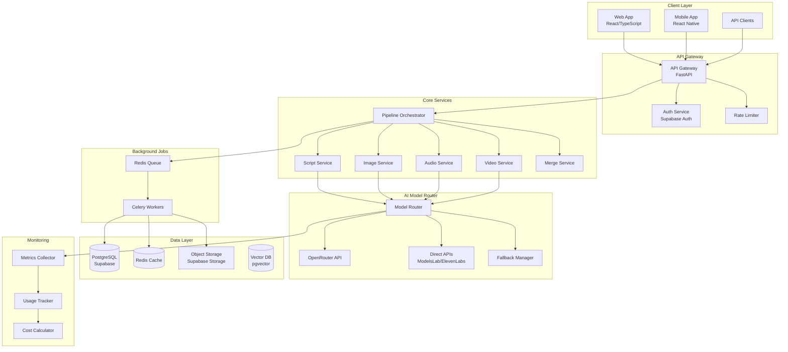

# LitinkAI Platform Architecture & AI Model Strategy

## Executive Summary

This document outlines the comprehensive architecture for LitinkAI, an AI-powered platform that transforms books and scripts into high-quality videos. The architecture focuses on optimal AI model integration, subscription-based tiering with 40-80% profit margins, and scalability for future expansion into marketing and training video capabilities.

## 1. AI Model Integration Strategy

### 1.1 Recommended Approach: **Hybrid OpenRouter + Direct API Strategy**

After analyzing your requirements, I recommend a hybrid approach combining OpenRouter for LLMs and direct API calls for specialized models:

#### Why This Approach?

**OpenRouter Advantages:**
- **Unified API** for multiple LLM providers (OpenAI, Anthropic, DeepSeek, Meta, Google)
- **Automatic fallback** when models are unavailable
- **Cost optimization** through smart routing
- **No vendor lock-in** - easy to switch models
- **Built-in rate limiting** and retry logic
- **Usage tracking** across all models
- **Pay-per-use** pricing with no monthly minimums

**Direct API for Specialized Models:**
- ModelsLab for video/image generation (already implemented)
- ElevenLabs for premium voice synthesis
- Specialized providers for unique features

### 1.2 Model Selection by Tier

```yaml
Model Configuration:
  Script Generation:
    Free Tier:
    provider: OpenRouter
      primary: "arliai/qwq-32b-arliai-rpr-v1:free" #$0/M input tokens $0/M output tokens
      fallback: "meta-llama/llama-3.2-3b-instruct" # $0.00006/1K tokens
    
    Basic Tier:
    provider: OpenRouter
      primary: "deepseek/deepseek-chat or deepseek-chat-v3-0324:free'" # $0.00014/1K tokens
      fallback: "mistralai/mistral-7b-instruct" # $0.00006/1K tokens
    
    Standard Tier:
      primary: "anthropic/claude-3-haiku" # $0.00025/1K tokens
      fallback: "openai/gpt-3.5-turbo" # $0.0005/1K tokens

    Professional Tier:
       primary: "openai/gpt-4o-mini" # $0.00015/1K tokens
      fallback: "anthropic/claude-3.5-sonnet" # $0.003/1K tokens
    
    Premium Tier:
    primary: "openai/gpt-4o" # $0.0025/1K tokens
      fallback: "anthropic/claude-3-opus" # $0.015/1K tokens

  Image Generation:
    Free Tier:
      provider: "ModelsLab v7"
      model: "Google/Imagen 4 Ultra" # ~$0.002/image
    
    Basic:
      provider: "ModelsLab v7"
      model: "Google/Imagen 4 Fast" # ~$0.004/image

    Standard Tier:

    Professional Tier:
    
    Premium:
      provider: "Direct API"
      model: "seedream-4-high-res" # ~$0.02/image via API
      alternative: "openai/dall-e-3" # $0.04/image

  Video Generation:
  Free Tier:
      provider: "ModelsLab V7"
      models: seeddance Image To Video
  basic Tier: 
      provider: "ModelsLab V7"
      models: "veo2" # ~$0.05/second
  
  premium: "Veo3-audio" # ~$0.10/second

  Cost & Tiering Strategy for Litinkai

Free & Basic tiers → stick with FFmpeg directly (cheaper, runs in your Render + Docker + Celery stack). Limit video length/resolution (e.g., 720p, 2–3 mins).

Pro → still use FFmpeg, but allow longer, higher-quality renders (1080p/4K, 10–20 mins).

Premium tiers & Enterprise tiers → consider offering hybrid OpenShot + FFmpeg, deployed on dedicated infra (AWS/GCP/Azure or even Hetzner/OVH bare metal for cost savings). This lets you provide timeline-based editing for bigger clients who might want fine control.

🔹 Recommended Setup for You (Cost-Effective + Scalable)

Since you’re on Render and using Dockerized Celery workers, here’s the optimal approach:

Start with FFmpeg-only implementation

Encapsulate each render as a Celery task.

Use Docker volume/mounted storage for temporary assets.

Store finished videos in a cheap object storage (e.g., Backblaze B2 or Wasabi, much cheaper than AWS S3).

Abstract your pipeline so you can later swap FFmpeg commands with OpenShot API if needed.

Example: have a “Renderer Service Layer” → can call FFmpeg directly now, and later OpenShot for Enterprise.

Use quotas per tier:

Free → short clips only (limit duration).

Basic → 720p max.

Pro → 1080p.

Premium → 4K, longer videos, faster rendering priority.

Enterprise → custom infra with OpenShot Cloud API for timeline editing.

✅ Conclusion:
For Litinkai right now (Render + Docker + Celery), go with FFmpeg only. It’s the most cost-effective, flexible, and production-ready option.
Later, for Enterprise tiers, you can layer OpenShot Cloud API on top for premium features (timeline, transitions, collaborative editing).

  Audio/Voice:
    Free Tier:
      provider: "ModelsLab"
      model: "elevenlabs-clone" # ~$0.001/1K chars
    
    Paid Tiers:
      provider: "ElevenLabs Direct"
      model: "eleven_multilingual_v2" # ~$0.30/1K chars
```

## 2. Subscription Tier Structure

### 2.1 Pricing Model with 40-80% Profit Margins

| Tier | Monthly Price | Cost per User | Profit Margin | Features |
|------|--------------|---------------|---------------|----------|
| **Free** | $0 | ~$2-3 | N/A | 2 videos/month, watermark, basic quality | no custom selection of model
| **Basic** | $19 | ~$8-10 | 47-58% | 10 videos/month, 720p, no watermark | no custom selection of model
| **Standard** | $49 | ~$20-25 | 49-59% | 30 videos/month, 1080p, voice cloning | custom selection of model
| **Premium** | $99 | ~$40-50 | 49-60% | 100 videos/month, 4K, priority processing |
| **Professional** | $299 | ~$100-150 | 50-67% | Unlimited*, API access, custom models |
| **Enterprise** | Custom | Variable | 60-80% | White-label, dedicated infrastructure |

*Unlimited with fair use policy (500 videos/month soft limit)

### 2.2 Cost Breakdown per Video Generation

```javascript
// Average 5-minute video cost calculation
const videoCostStructure = {
  free: {
    script: 0.05,      // 3K tokens @ $0.00006/1K
    images: 0.10,      // 50 images @ $0.002
    audio: 0.05,       // 5K chars @ $0.001/1K
    video: 0.50,       // 10 segments @ $0.05
    total: 0.70,       // Total cost per video
    price: 0.00,       // Free (subsidized)
  },
  basic: {
    script: 0.15,      // Better model
    images: 0.20,      // Higher quality
    audio: 0.30,       // ElevenLabs
    video: 1.00,       // Better quality
    total: 1.65,
    price: 1.90,       // $19/10 videos
  },
  standard: {
    script: 0.25,
    images: 0.40,
    audio: 0.50,
    video: 1.50,
    total: 2.65,
    price: 1.63,       // $49/30 videos
  },
  premium: {
    script: 0.50,
    images: 1.00,
    audio: 0.75,
    video: 2.00,
    total: 4.25,
    price: 0.99,       // $99/100 videos
  }
};
```

## 3. System Architecture

### 3.1 High-Level Architecture



### 3.2 Model Router Implementation

```python
# Model Router Service Architecture
class ModelRouter:
    """
    Intelligent routing system for AI models based on:
    - User subscription tier
    - Cost optimization
    - Model availability
    - Quality requirements
    """
    
    def __init__(self):
        self.openrouter_client = OpenRouterClient()
        self.direct_clients = {
            'modelslab': ModelsLabClient(),
            'elevenlabs': ElevenLabsClient(),
            'deepseek': DeepSeekClient()
        }
        self.fallback_manager = FallbackManager()
        self.cost_tracker = CostTracker()
    
    async def route_request(
        self,
        request_type: str,
        user_tier: str,
        content: dict,
        quality_override: Optional[str] = None
    ) -> ModelResponse:
        """
        Routes request to appropriate model based on multiple factors
        """
        # Get model configuration for tier
        model_config = self.get_model_for_tier(request_type, user_tier)
        
        # Check rate limits
        if await self.is_rate_limited(user_id, model_config):
            model_config = await self.get_fallback_model(model_config)
        
        # Track costs
        estimated_cost = await self.estimate_cost(model_config, content)
        
        # Execute request with retry logic
        response = await self.execute_with_retry(
            model_config,
            content,
            max_retries=3
        )
        
        # Record actual costs
        await self.cost_tracker.record(
            user_id=content['user_id'],
            model=model_config['model'],
            cost=response.actual_cost,
            tokens=response.token_count
        )
        
        return response
```

### 3.3 Pipeline Orchestration

```python
# Enhanced Pipeline Manager
class EnhancedPipelineManager:
    """
    Manages end-to-end video generation pipeline with
    tier-based quality control and optimization
    """
    
    stages = [
        'script_generation',
        'scene_breakdown',
        'image_generation',
        'audio_generation',
        'video_generation',
        'lip_sync',
        'post_processing',
        'quality_check'
    ]
    
    async def execute_pipeline(
        self,
        book_content: str,
        user_tier: str,
        options: dict
    ) -> PipelineResult:
        """
        Executes complete pipeline with tier-based optimizations
        """
        # Initialize pipeline context
        context = PipelineContext(
            user_tier=user_tier,
            quality_level=self.get_quality_for_tier(user_tier),
            parallel_processing=user_tier in ['premium', 'professional'],
            priority=self.get_priority_for_tier(user_tier)
        )
        
        # Execute stages
        for stage in self.stages:
            if context.should_skip_stage(stage):
                continue
                
            result = await self.execute_stage(
                stage=stage,
                context=context,
                previous_results=context.results
            )
            
            context.add_result(stage, result)
            
            # Cost optimization for lower tiers
            if context.is_approaching_limit():
                context.apply_optimizations()
        
        return context.get_final_result()
```

## 4. Cost Tracking & Usage Monitoring

### 4.1 Database Schema for Usage Tracking

```sql
-- User subscription and limits
CREATE TABLE user_subscriptions (
    id UUID PRIMARY KEY DEFAULT gen_random_uuid(),
    user_id UUID REFERENCES users(id),
    tier VARCHAR(50) NOT NULL,
    status VARCHAR(20) DEFAULT 'active',
    current_period_start TIMESTAMP,
    current_period_end TIMESTAMP,
    video_count_limit INTEGER,
    video_count_used INTEGER DEFAULT 0,
    created_at TIMESTAMP DEFAULT NOW(),
    updated_at TIMESTAMP DEFAULT NOW()
);

-- Detailed usage tracking
CREATE TABLE usage_logs (
    id UUID PRIMARY KEY DEFAULT gen_random_uuid(),
    user_id UUID REFERENCES users(id),
    resource_type VARCHAR(50), -- 'script', 'image', 'audio', 'video'
    model_used VARCHAR(100),
    input_tokens INTEGER,
    output_tokens INTEGER,
    duration_seconds FLOAT,
    cost_usd DECIMAL(10, 6),
    tier_at_time VARCHAR(50),
    metadata JSONB,
    created_at TIMESTAMP DEFAULT NOW()
);

-- Cost aggregation for billing
CREATE TABLE cost_aggregations (
    id UUID PRIMARY KEY DEFAULT gen_random_uuid(),
    user_id UUID REFERENCES users(id),
    period_start DATE,
    period_end DATE,
    total_cost DECIMAL(10, 4),
    total_videos INTEGER,
    breakdown JSONB, -- Detailed cost breakdown
    created_at TIMESTAMP DEFAULT NOW()
);

-- Model performance metrics
CREATE TABLE model_metrics (
    id UUID PRIMARY KEY DEFAULT gen_random_uuid(),
    model_name VARCHAR(100),
    request_count INTEGER DEFAULT 0,
    success_count INTEGER DEFAULT 0,
    failure_count INTEGER DEFAULT 0,
    avg_latency_ms FLOAT,
    avg_cost_usd DECIMAL(10, 6),
    date DATE,
    UNIQUE(model_name, date)
);
```

### 4.2 Real-time Cost Monitoring

```python
class CostMonitor:
    """
    Real-time monitoring of AI model costs with alerts
    """
    
    def __init__(self):
        self.redis_client = Redis()
        self.alert_thresholds = {
            'free': 3.00,      # Alert if free user costs exceed $3
            'basic': 15.00,    # 75% of revenue
            'standard': 35.00,  # 71% of revenue
            'premium': 70.00,   # 70% of revenue
            'professional': 200.00
        }
    
    async def track_cost(
        self,
        user_id: str,
        cost: float,
        resource: str
    ):
        # Update real-time counters
        key = f"cost:{user_id}:{datetime.now().strftime('%Y-%m')}"
        current_cost = await self.redis_client.incrbyfloat(key, cost)
        
        # Check thresholds
        user_tier = await self.get_user_tier(user_id)
        threshold = self.alert_thresholds.get(user_tier)
        
        if current_cost > threshold:
            await self.trigger_cost_alert(user_id, current_cost, threshold)
            
            # Potentially throttle or switch to cheaper models
            if current_cost > threshold * 1.2:
                await self.apply_cost_reduction_measures(user_id)
```

## 5. Phase 2: Marketing & Training Video Features

### 5.1 Expanded Capabilities (Veed.io/InVideo Features)

```yaml
Phase 2 Features:
  Marketing Videos:
    - Social media templates (TikTok, Instagram, YouTube Shorts)
    - Product demos and explainers
    - Animated infographics
    - Brand kit integration
    - Multi-language support
    - A/B testing variants
    
  Training & Education:
    - Screen recording integration
    - Interactive elements (quizzes, hotspots)
    - Chapter markers and navigation
    - Closed captions and transcripts
    - SCORM export for LMS
    - Analytics and engagement tracking
    
  Collaboration:
    - Team workspaces
    - Review and approval workflows
    - Version control
    - Comments and annotations
    - Real-time collaboration
    
  Advanced Editing:
    - Timeline-based editor
    - Transitions and effects library
    - Green screen removal
    - Audio mixing and enhancement
    - Custom animations
    - Brand overlays and watermarks
```

### 5.2 Technical Architecture for Phase 2

```python
# Extended Service Architecture
class VideoEditorService:
    """
    Advanced video editing capabilities for Phase 2
    """
    
    capabilities = {
        'templates': TemplateEngine(),
        'effects': EffectsProcessor(),
        'collaboration': CollaborationManager(),
        'analytics': AnalyticsEngine(),
        'export': ExportManager()
    }
    
    async def create_marketing_video(
        self,
        template_id: str,
        brand_kit: dict,
        content: dict,
        target_platforms: List[str]
    ) -> MarketingVideo:
        # Generate platform-specific versions
        videos = []
        for platform in target_platforms:
            spec = self.get_platform_spec(platform)
            video = await self.generate_video(
                template_id=template_id,
                brand_kit=brand_kit,
                content=content,
                aspect_ratio=spec.aspect_ratio,
                duration=spec.max_duration,
                style=spec.recommended_style
            )
            videos.append(video)
        
        return MarketingVideo(
            versions=videos,
            analytics_enabled=True,
            ab_testing_enabled=len(videos) > 1
        )
```

## 6. Scalability & Performance Optimization

### 6.1 Caching Strategy

```python
class MultiLevelCache:
    """
    Multi-level caching for optimal performance
    """
    
    levels = {
        'L1': MemoryCache(ttl=300),      # 5 minutes in-memory
        'L2': RedisCache(ttl=3600),      # 1 hour Redis
        'L3': CDNCache(ttl=86400),       # 24 hours CDN
        'L4': S3Cache(ttl=604800)        # 7 days S3
    }
    
    async def get_or_generate(
        self,
        key: str,
        generator_func: Callable,
        cache_level: str = 'L2'
    ):
        # Check caches in order
        for level in ['L1', 'L2', 'L3', 'L4']:
            if cached := await self.levels[level].get(key):
                # Promote to higher cache levels
                await self.promote_to_higher_levels(key, cached, level)
                return cached
            
            if level == cache_level:
                break
        
        # Generate and cache
        result = await generator_func()
        await self.cache_at_level(key, result, cache_level)
        return result
```

### 6.2 Queue Management

```python
class PriorityQueueManager:
    """
    Priority-based queue management for different tiers
    """
    
    queues = {
        'professional': PriorityQueue(priority=1, workers=10),
        'premium': PriorityQueue(priority=2, workers=8),
        'standard': PriorityQueue(priority=3, workers=6),
        'basic': PriorityQueue(priority=4, workers=4),
        'free': PriorityQueue(priority=5, workers=2)
    }
    
    async def enqueue_job(
        self,
        job: VideoGenerationJob,
        user_tier: str
    ):
        queue = self.queues[user_tier]
        
        # Add to appropriate queue
        await queue.add(
            job,
            priority=self.calculate_priority(job, user_tier),
            estimated_duration=self.estimate_duration(job)
        )
        
        # Return estimated completion time
        position = await queue.get_position(job.id)
        estimated_time = await queue.estimate_completion_time(position)
        
        return {
            'job_id': job.id,
            'queue_position': position,
            'estimated_completion': estimated_time
        }
```

## 7. Implementation Roadmap

### Phase 1: Core Platform (Months 1-3)
1. **Month 1**: OpenRouter Integration
   - Integrate OpenRouter API
   - Implement model router
   - Set up fallback mechanisms
   - Create cost tracking system

2. **Month 2**: Subscription System
   - Implement tier-based access control
   - Create usage monitoring
   - Set up billing integration
   - Build admin dashboard

3. **Month 3**: Optimization & Testing
   - Performance optimization
   - Load testing
   - Cost optimization
   - User acceptance testing

### Phase 2: Advanced Features (Months 4-6)
4. **Month 4**: Marketing Video Features
   - Template system
   - Social media formats
   - Brand kit integration

5. **Month 5**: Training Video Features
   - Screen recording
   - Interactive elements
   - Analytics integration

6. **Month 6**: Collaboration & Enterprise
   - Team workspaces
   - White-label options
   - API documentation
   - Enterprise features

## 8. Migration Strategy

### 8.1 Gradual Migration Plan

```python
# Migration from current system to new architecture
migration_steps = [
    {
        'step': 1,
        'action': 'Add OpenRouter alongside existing APIs',
        'rollback': 'Disable OpenRouter, use existing',
        'duration': '1 week',
        'risk': 'low'
    },
    {
        'step': 2,
        'action': 'Implement tier system with feature flags',
        'rollback': 'Disable tiers, all users premium',
        'duration': '2 weeks',
        'risk': 'medium'
    },
    {
        'step': 3,
        'action': 'Migrate 10% users to new system',
        'rollback': 'Move users back to old system',
        'duration': '1 week',
        'risk': 'medium'
    },
    {
        'step': 4,
        'action': 'Gradual rollout to 100%',
        'rollback': 'Staged rollback if issues',
        'duration': '2 weeks',
        'risk': 'low'
    }
]
```

## 9. Monitoring & Analytics

### 9.1 Key Metrics to Track

```yaml
Business Metrics:
  - Monthly Recurring Revenue (MRR)
  - Customer Acquisition Cost (CAC)
  - Lifetime Value (LTV)
  - Churn Rate by Tier
  - Upgrade/Downgrade Rate
  - Cost per Video Generated
  - Profit Margin by Tier

Technical Metrics:
  - API Response Times
  - Model Success Rates
  - Queue Wait Times by Tier
  - Storage Usage
  - Bandwidth Consumption
  - Error Rates by Service
  - Cache Hit Rates

User Metrics:
  - Videos Generated per User
  - Feature Usage by Tier
  - Time to First Video
  - Completion Rates
  - User Satisfaction (NPS)
  - Support Ticket Volume
```

## 10. Security & Compliance

### 10.1 Security Measures

```yaml
Security Implementation:
  API Security:
    - Rate limiting per tier
    - API key rotation
    - Request signing
    - IP whitelisting for enterprise
    
  Data Security:
    - Encryption at rest (AES-256)
    - Encryption in transit (TLS 1.3)
    - PII data masking
    - Secure key management (AWS KMS)
    
  Content Security:
    - Content moderation APIs
    - NSFW detection
    - Copyright detection
    - Watermarking for free tier
    
  Compliance:
    - GDPR compliance
    - CCPA compliance
    - SOC 2 Type II (future)
    - ISO 27001 (future)
```

## Conclusion

This architecture provides:
1. **Optimal AI model integration** through OpenRouter + direct APIs
2. **Profitable subscription tiers** with 40-80% margins
3. **Scalable infrastructure** ready for growth
4. **Clear migration path** from current system
5. **Foundation for Phase 2** marketing/training features

The hybrid approach balances cost, quality, and flexibility while maintaining healthy profit margins across all tiers. The system is designed to scale from hundreds to millions of users while maintaining performance and profitability.

## Next Steps

1. Review and approve architecture
2. Set up OpenRouter account and API keys
3. Implement model router service
4. Create subscription management system
5. Begin gradual migration
6. Monitor costs and optimize
7. Launch Phase 2 features

---

*Document Version: 1.0*  
*Last Updated: 2024*  
*Status: Ready for Review*