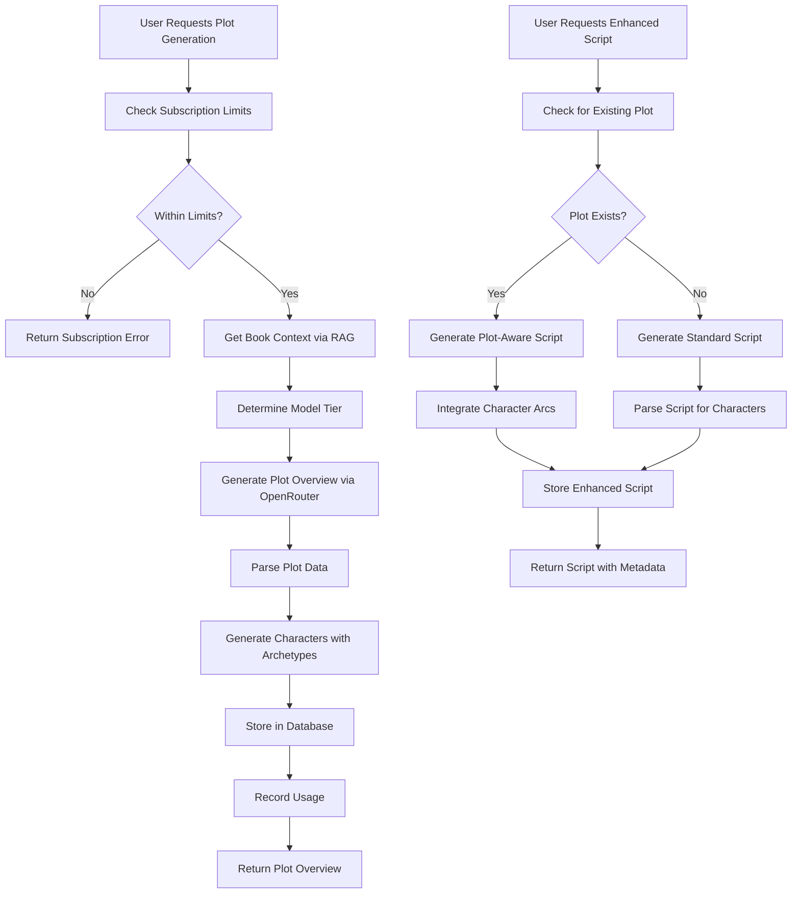
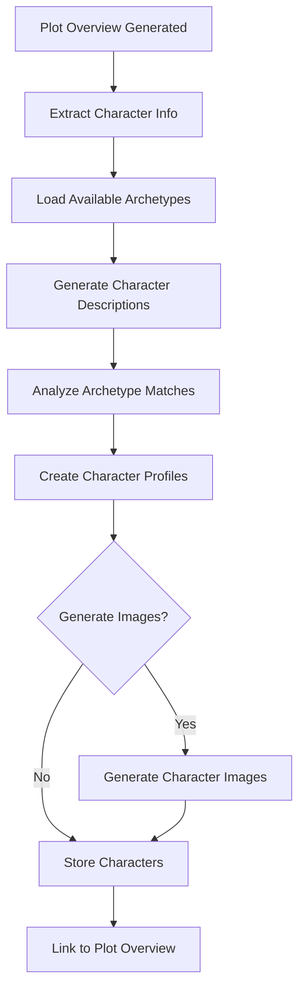

# Plot Generation Backend Architecture Design

## Executive Summary

This document outlines the comprehensive backend architecture for plot generation functionality that integrates with the existing LitinkAI system. The design supports plot overview generation, character profiling with archetype analysis, enhanced script generation, and comprehensive script management with versioning capabilities.

## System Integration Analysis

### Existing System Components

**Core Infrastructure:**
- **Database**: Supabase PostgreSQL with existing tables: `books`, `chapters`, `scripts`, `user_subscriptions`, `usage_logs`
- **LLM Service**: [`OpenRouterService`](backend/app/services/openrouter_service.py:17) with tier-based model routing (FREE → PROFESSIONAL)
- **Subscription Management**: [`SubscriptionManager`](backend/app/services/subscription_manager.py:19) with usage tracking and limits
- **RAG System**: [`RAGService`](backend/app/services/rag_service.py:8) for content retrieval and context enhancement
- **Script Generation**: Existing pipeline in [`/ai/generate-script-and-scenes`](backend/app/api/v1/ai.py:1703)

**Integration Points Identified:**
1. **OpenRouter Integration**: Leverage tier-based LLM access for plot generation
2. **Subscription Limits**: Integrate plot generation with existing usage tracking
3. **RAG Enhancement**: Use book content analysis for character and plot development
4. **Script Pipeline**: Extend existing script generation with plot-aware capabilities
5. **Database Schema**: Extend existing structure with new plot-specific tables

## Database Schema Design

### New Tables

```sql
-- Plot Overviews Table
CREATE TABLE plot_overviews (
    id UUID PRIMARY KEY DEFAULT gen_random_uuid(),
    book_id UUID NOT NULL REFERENCES books(id) ON DELETE CASCADE,
    user_id UUID NOT NULL REFERENCES auth.users(id) ON DELETE CASCADE,
    
    -- Core Plot Elements
    logline TEXT,
    themes JSONB DEFAULT '[]',
    story_type VARCHAR(50),
    genre VARCHAR(50),
    tone VARCHAR(50),
    audience VARCHAR(50),
    setting TEXT,
    
    -- Generation Metadata
    generation_method VARCHAR(50) DEFAULT 'openrouter',
    model_used VARCHAR(100),
    generation_cost DECIMAL(10,6) DEFAULT 0,
    
    -- Status and Versioning
    status VARCHAR(20) DEFAULT 'active', -- 'active', 'archived', 'deleted'
    version INTEGER DEFAULT 1,
    
    created_at TIMESTAMPTZ DEFAULT NOW(),
    updated_at TIMESTAMPTZ DEFAULT NOW(),
    
    -- Constraints
    UNIQUE(book_id, user_id, version)
);

-- Characters Table
CREATE TABLE characters (
    id UUID PRIMARY KEY DEFAULT gen_random_uuid(),
    plot_overview_id UUID NOT NULL REFERENCES plot_overviews(id) ON DELETE CASCADE,
    book_id UUID NOT NULL REFERENCES books(id) ON DELETE CASCADE,
    user_id UUID NOT NULL REFERENCES auth.users(id) ON DELETE CASCADE,
    
    -- Core Character Info
    name VARCHAR(255) NOT NULL,
    role VARCHAR(100), -- 'protagonist', 'antagonist', 'supporting', 'minor'
    character_arc TEXT,
    physical_description TEXT,
    personality TEXT,
    
    -- Character Development
    archetypes JSONB DEFAULT '[]', -- Array of archetype strings
    want TEXT, -- External goal
    need TEXT, -- Internal need
    lie TEXT, -- Character's false belief
    ghost TEXT, -- Backstory wound
    
    -- Visual Assets
    image_url TEXT,
    image_generation_prompt TEXT,
    image_metadata JSONB DEFAULT '{}',
    
    -- Generation Metadata
    generation_method VARCHAR(50) DEFAULT 'openrouter',
    model_used VARCHAR(100),
    
    created_at TIMESTAMPTZ DEFAULT NOW(),
    updated_at TIMESTAMPTZ DEFAULT NOW(),
    
    -- Ensure unique character names per plot
    UNIQUE(plot_overview_id, name)
);

-- Chapter Scripts Enhanced (extends existing scripts table functionality)
CREATE TABLE chapter_scripts (
    id UUID PRIMARY KEY DEFAULT gen_random_uuid(),
    chapter_id UUID NOT NULL REFERENCES chapters(id) ON DELETE CASCADE,
    plot_overview_id UUID REFERENCES plot_overviews(id) ON DELETE SET NULL,
    script_id UUID REFERENCES scripts(id) ON DELETE CASCADE, -- Link to existing scripts
    user_id UUID NOT NULL REFERENCES auth.users(id) ON DELETE CASCADE,
    
    -- Script Enhancement Data
    plot_enhanced BOOLEAN DEFAULT false,
    character_enhanced BOOLEAN DEFAULT false,
    
    -- Scene Breakdown
    scenes JSONB DEFAULT '[]', -- Array of scene objects
    acts JSONB DEFAULT '[]', -- Array of act objects
    beats JSONB DEFAULT '[]', -- Array of story beat objects
    
    -- Character Integration
    character_details JSONB DEFAULT '{}', -- Character info used in script
    character_arcs JSONB DEFAULT '{}', -- Character arc progression
    
    -- Status and Metadata
    status VARCHAR(20) DEFAULT 'active', -- 'active', 'archived', 'deleted'
    version INTEGER DEFAULT 1,
    generation_metadata JSONB DEFAULT '{}',
    
    created_at TIMESTAMPTZ DEFAULT NOW(),
    updated_at TIMESTAMPTZ DEFAULT NOW(),
    
    -- Constraints
    UNIQUE(chapter_id, user_id, version)
);

-- Archetype Definitions (Reference Table)
CREATE TABLE character_archetypes (
    id UUID PRIMARY KEY DEFAULT gen_random_uuid(),
    name VARCHAR(100) UNIQUE NOT NULL,
    description TEXT NOT NULL,
    category VARCHAR(50), -- 'hero', 'mentor', 'shadow', etc.
    traits JSONB DEFAULT '[]',
    typical_roles JSONB DEFAULT '[]',
    example_characters TEXT,
    
    created_at TIMESTAMPTZ DEFAULT NOW(),
    is_active BOOLEAN DEFAULT true
);
```

### Indexes for Performance

```sql
-- Plot Overviews
CREATE INDEX idx_plot_overviews_book_user ON plot_overviews(book_id, user_id);
CREATE INDEX idx_plot_overviews_status ON plot_overviews(status);
CREATE INDEX idx_plot_overviews_created_at ON plot_overviews(created_at);

-- Characters
CREATE INDEX idx_characters_plot_overview ON characters(plot_overview_id);
CREATE INDEX idx_characters_book_user ON characters(book_id, user_id);
CREATE INDEX idx_characters_role ON characters(role);
CREATE INDEX idx_characters_archetypes ON characters USING GIN(archetypes);

-- Chapter Scripts
CREATE INDEX idx_chapter_scripts_chapter ON chapter_scripts(chapter_id);
CREATE INDEX idx_chapter_scripts_plot ON chapter_scripts(plot_overview_id);
CREATE INDEX idx_chapter_scripts_user ON chapter_scripts(user_id);
CREATE INDEX idx_chapter_scripts_status ON chapter_scripts(status);

-- Archetypes
CREATE INDEX idx_character_archetypes_category ON character_archetypes(category);
CREATE INDEX idx_character_archetypes_active ON character_archetypes(is_active);
```

### Row Level Security (RLS) Policies

```sql
-- Enable RLS
ALTER TABLE plot_overviews ENABLE ROW LEVEL SECURITY;
ALTER TABLE characters ENABLE ROW LEVEL SECURITY;
ALTER TABLE chapter_scripts ENABLE ROW LEVEL SECURITY;
ALTER TABLE character_archetypes ENABLE ROW LEVEL SECURITY;

-- Plot Overviews Policies
CREATE POLICY "Users manage own plot overviews" ON plot_overviews
    FOR ALL USING (auth.uid() = user_id);

-- Characters Policies
CREATE POLICY "Users manage own characters" ON characters
    FOR ALL USING (auth.uid() = user_id);

-- Chapter Scripts Policies
CREATE POLICY "Users manage own chapter scripts" ON chapter_scripts
    FOR ALL USING (auth.uid() = user_id);

-- Archetypes Policies (Public read, admin write)
CREATE POLICY "Everyone reads active archetypes" ON character_archetypes
    FOR SELECT USING (is_active = true);
```

## Service Layer Architecture

### 1. Plot Generation Service

```python
# backend/app/services/plot_service.py
from typing import Dict, Any, List, Optional
from app.services.openrouter_service import OpenRouterService, ModelTier
from app.services.subscription_manager import SubscriptionManager
from app.services.rag_service import RAGService
from app.core.database import get_supabase

class PlotService:
    """
    Comprehensive plot generation and management service
    Integrates with OpenRouter, Subscription, and RAG services
    """
    
    def __init__(self, supabase_client=None):
        self.supabase = supabase_client or get_supabase()
        self.openrouter = OpenRouterService()
        self.subscription_manager = SubscriptionManager(supabase_client)
        self.rag_service = RAGService(supabase_client)
    
    async def generate_plot_overview(
        self, 
        book_id: str, 
        user_id: str,
        custom_instructions: Optional[str] = None
    ) -> Dict[str, Any]:
        """
        Generate comprehensive plot overview using book content and RAG
        """
        
        # 1. Check subscription limits
        user_tier = await self.subscription_manager.get_user_tier(user_id)
        usage_check = await self.subscription_manager.check_usage_limits(user_id, "plot_generation")
        
        if not usage_check["can_generate"]:
            raise SubscriptionLimitError(f"Plot generation limit reached for {user_tier.value} tier")
        
        # 2. Get book context via RAG
        book_context = await self._get_book_context_for_plot(book_id)
        
        # 3. Map subscription tier to model tier
        model_tier = self._map_subscription_to_model_tier(user_tier)
        
        # 4. Generate plot overview
        plot_result = await self.openrouter.generate_script(
            content=self._build_plot_generation_prompt(book_context, custom_instructions),
            user_tier=model_tier,
            script_type="plot_analysis"
        )
        
        if plot_result.get('status') != 'success':
            raise PlotGenerationError(f"Plot generation failed: {plot_result.get('error')}")
        
        # 5. Parse and structure plot overview
        parsed_plot = await self._parse_plot_overview(plot_result['content'])
        
        # 6. Generate characters with archetypes
        characters = await self._generate_characters_with_archetypes(
            plot_context=parsed_plot,
            book_context=book_context,
            user_tier=model_tier
        )
        
        # 7. Store in database
        plot_overview = await self._store_plot_overview(
            book_id=book_id,
            user_id=user_id,
            plot_data=parsed_plot,
            characters=characters,
            generation_metadata={
                'model_used': plot_result.get('model_used'),
                'cost': plot_result.get('usage', {}).get('estimated_cost', 0),
                'tier': user_tier.value
            }
        )
        
        # 8. Record usage
        await self.subscription_manager.record_usage(
            user_id=user_id,
            resource_type='plot_generation',
            cost_usd=plot_result.get('usage', {}).get('estimated_cost', 0),
            metadata={'book_id': book_id, 'plot_id': plot_overview['id']}
        )
        
        return plot_overview
    
    async def _generate_characters_with_archetypes(
        self, 
        plot_context: Dict[str, Any],
        book_context: Dict[str, Any],
        user_tier: ModelTier
    ) -> List[Dict[str, Any]]:
        """Generate characters with detailed archetype analysis"""
        
        # Get available archetypes
        archetypes = await self._get_available_archetypes()
        
        character_prompt = self._build_character_generation_prompt(
            plot_context, book_context, archetypes
        )
        
        char_result = await self.openrouter.analyze_content(
            content=character_prompt,
            user_tier=user_tier,
            analysis_type="characters"
        )
        
        if char_result.get('status') == 'success':
            return await self._parse_characters_with_archetypes(
                char_result['result'], archetypes
            )
        
        return []
    
    async def enhance_script_with_plot(
        self, 
        chapter_id: str, 
        script_id: str, 
        user_id: str
    ) -> Dict[str, Any]:
        """
        Enhance existing script with plot overview and character details
        """
        
        # 1. Get plot overview for book
        plot_overview = await self._get_plot_overview_for_chapter(chapter_id)
        
        if not plot_overview:
            raise PlotNotFoundError("No plot overview found for this chapter's book")
        
        # 2. Get existing script
        script = await self._get_script_by_id(script_id)
        
        # 3. Get character details
        characters = await self._get_characters_for_plot(plot_overview['id'])
        
        # 4. Enhance script with plot context
        enhanced_script = await self._enhance_script_with_plot_context(
            script=script,
            plot_overview=plot_overview,
            characters=characters,
            user_id=user_id
        )
        
        return enhanced_script
```

### 2. Character Service

```python
# backend/app/services/character_service.py
class CharacterService:
    """
    Character profiling and archetype analysis service
    """
    
    async def analyze_character_archetypes(
        self, 
        character_description: str,
        user_tier: ModelTier
    ) -> Dict[str, Any]:
        """
        Analyze character and match to archetypes using LLM
        """
        
        archetypes = await self._get_available_archetypes()
        
        analysis_prompt = f"""
        Analyze the following character description and identify the most fitting archetypes:
        
        Character: {character_description}
        
        Available Archetypes: {[a['name'] + ': ' + a['description'] for a in archetypes]}
        
        Provide:
        1. Primary archetype (most dominant)
        2. Secondary archetypes (2-3 additional fits)
        3. Character traits analysis
        4. Archetypal strengths and shadows
        5. Story role suggestions
        
        Format as structured JSON.
        """
        
        result = await self.openrouter.analyze_content(
            content=analysis_prompt,
            user_tier=user_tier,
            analysis_type="characters"
        )
        
        return await self._parse_archetype_analysis(result['result'])
    
    async def generate_character_image(
        self, 
        character_id: str, 
        user_id: str,
        custom_prompt: Optional[str] = None
    ) -> str:
        """
        Generate character image using existing image generation service
        """
        
        character = await self._get_character_by_id(character_id)
        
        # Build image prompt from character data
        image_prompt = custom_prompt or self._build_character_image_prompt(character)
        
        # Use existing image generation service
        from app.services.modelslab_v7_image_service import ModelsLabV7ImageService
        image_service = ModelsLabV7ImageService()
        
        image_result = await image_service.generate_image(
            prompt=image_prompt,
            aspect_ratio="3:4",  # Portrait for characters
            model_id="gen4_image"
        )
        
        # Store image reference in character record
        await self._update_character_image(
            character_id, 
            image_result['image_url'],
            image_prompt
        )
        
        return image_result['image_url']
```

## API Endpoints Design

### Plot Overview Endpoints

```python
# backend/app/api/v1/plots.py
from fastapi import APIRouter, Depends, HTTPException
from app.services.plot_service import PlotService
from app.schemas.plot import *

router = APIRouter(prefix="/books/{book_id}/plot", tags=["Plot Generation"])

@router.post("/generate", response_model=PlotOverviewResponse)
async def generate_plot_overview(
    book_id: str,
    request: PlotGenerationRequest,
    current_user: dict = Depends(get_current_active_user),
    supabase_client = Depends(get_supabase)
):
    """
    Generate comprehensive plot overview using book content and RAG
    
    Features:
    - Analyzes entire book content using RAG
    - Generates logline, themes, genre analysis
    - Creates character profiles with archetypes
    - Integrates with subscription limits
    """
    
    plot_service = PlotService(supabase_client)
    
    try:
        plot_overview = await plot_service.generate_plot_overview(
            book_id=book_id,
            user_id=current_user['id'],
            custom_instructions=request.custom_instructions
        )
        
        return PlotOverviewResponse(**plot_overview)
        
    except SubscriptionLimitError as e:
        raise HTTPException(status_code=402, detail=str(e))
    except Exception as e:
        raise HTTPException(status_code=500, detail=f"Plot generation failed: {str(e)}")

@router.post("/save", response_model=PlotOverviewResponse)
async def save_plot_overview(
    book_id: str,
    plot_data: PlotOverviewSave,
    current_user: dict = Depends(get_current_active_user),
    supabase_client = Depends(get_supabase)
):
    """Save or update plot overview"""
    
    plot_service = PlotService(supabase_client)
    
    saved_plot = await plot_service.save_plot_overview(
        book_id=book_id,
        user_id=current_user['id'],
        plot_data=plot_data.dict()
    )
    
    return PlotOverviewResponse(**saved_plot)

@router.get("", response_model=PlotOverviewResponse)
async def get_plot_overview(
    book_id: str,
    current_user: dict = Depends(get_current_active_user),
    supabase_client = Depends(get_supabase)
):
    """Load existing plot overview"""
    
    plot_service = PlotService(supabase_client)
    
    plot_overview = await plot_service.get_plot_overview(
        book_id=book_id,
        user_id=current_user['id']
    )
    
    if not plot_overview:
        raise HTTPException(status_code=404, detail="No plot overview found")
    
    return PlotOverviewResponse(**plot_overview)
```

### Enhanced Script Generation

```python
# backend/app/api/v1/ai.py (additions)

@router.post("/generate-script-and-scenes", response_model=EnhancedScriptResponse)
async def generate_enhanced_script_and_scenes(
    request: EnhancedScriptRequest,
    current_user: dict = Depends(get_current_active_user),
    supabase_client: Client = Depends(get_supabase)
):
    """
    Generate enhanced scripts using plot overview and character details
    
    Features:
    - Uses existing plot overview if available
    - Incorporates character archetypes and development
    - Enhanced scene breakdown with character arcs
    - Multiple script storage per chapter
    """
    
    # Check if plot overview exists
    plot_service = PlotService(supabase_client)
    plot_overview = await plot_service.get_plot_overview_for_chapter(request.chapter_id)
    
    # Get subscription tier for model selection
    subscription_manager = SubscriptionManager(supabase_client)
    user_tier = await subscription_manager.get_user_tier(current_user['id'])
    model_tier = plot_service._map_subscription_to_model_tier(user_tier)
    
    # Generate enhanced script
    if plot_overview:
        # Generate plot-aware script
        script_result = await plot_service.generate_plot_aware_script(
            chapter_id=request.chapter_id,
            plot_overview=plot_overview,
            script_style=request.script_style,
            user_tier=model_tier,
            user_id=current_user['id']
        )
    else:
        # Fall back to standard script generation
        script_result = await plot_service.generate_standard_script(
            chapter_id=request.chapter_id,
            script_style=request.script_style,
            user_tier=model_tier,
            user_id=current_user['id']
        )
    
    return EnhancedScriptResponse(**script_result)

@router.get("/scripts/{chapter_id}", response_model=ChapterScriptsResponse)
async def get_chapter_scripts(
    chapter_id: str,
    current_user: dict = Depends(get_current_active_user),
    supabase_client: Client = Depends(get_supabase)
):
    """Get all scripts for a chapter with enhanced metadata"""
    
    plot_service = PlotService(supabase_client)
    
    scripts = await plot_service.get_chapter_scripts_with_metadata(
        chapter_id=chapter_id,
        user_id=current_user['id']
    )
    
    return ChapterScriptsResponse(
        chapter_id=chapter_id,
        scripts=scripts,
        total=len(scripts)
    )
```

## Schema Definitions

```python
# backend/app/schemas/plot.py
from pydantic import BaseModel
from typing import List, Optional, Dict, Any
from datetime import datetime

class Character(BaseModel):
    name: str
    role: str  # 'protagonist', 'antagonist', 'supporting', 'minor'
    character_arc: str
    physical_description: str
    personality: str
    archetypes: List[str]
    want: str  # External goal
    need: str  # Internal need
    lie: str   # Character's false belief
    ghost: str # Backstory wound
    image_url: Optional[str] = None

class PlotOverview(BaseModel):
    logline: str
    themes: List[str]
    story_type: str
    genre: str
    tone: str
    audience: str
    setting: str
    characters: List[Character]

class PlotGenerationRequest(BaseModel):
    custom_instructions: Optional[str] = None
    include_character_images: bool = False

class PlotOverviewSave(BaseModel):
    logline: str
    themes: List[str]
    story_type: str
    genre: str
    tone: str
    audience: str
    setting: str
    characters: List[Character]

class PlotOverviewResponse(BaseModel):
    id: str
    book_id: str
    plot_overview: PlotOverview
    status: str
    version: int
    generation_metadata: Dict[str, Any]
    created_at: datetime
    updated_at: datetime

class EnhancedScriptRequest(BaseModel):
    chapter_id: str
    script_style: str = "cinematic"
    use_plot_context: bool = True
    enhance_character_development: bool = True

class Scene(BaseModel):
    scene_number: int
    description: str
    characters: List[str]
    arc_progression: Dict[str, str]  # character_name -> arc_note
    camera_notes: Optional[str] = None
    audio_notes: Optional[str] = None

class EnhancedScriptResponse(BaseModel):
    chapter_id: str
    script_id: str
    script: str
    scenes: List[Scene]
    characters: List[Character]
    plot_enhanced: bool
    character_enhanced: bool
    metadata: Dict[str, Any]
```

## RAG Integration Enhancement

### Book Content Analysis for Plot Generation

```python
# backend/app/services/rag_service.py (enhancements)

async def get_book_plot_context(self, book_id: str) -> Dict[str, Any]:
    """
    Analyze entire book for plot generation context
    """
    
    # Get all chapters
    chapters_response = self.db.table('chapters')\
        .select('*')\
        .eq('book_id', book_id)\
        .order('chapter_number')\
        .execute()
    
    chapters = chapters_response.data or []
    
    # Analyze book structure
    book_analysis = {
        'total_chapters': len(chapters),
        'estimated_word_count': sum(len(ch.get('content', '').split()) for ch in chapters),
        'chapter_summaries': [],
        'recurring_themes': [],
        'character_mentions': {},
        'setting_descriptions': [],
        'conflict_analysis': None
    }
    
    # Use vector search for thematic analysis
    for chapter in chapters[:5]:  # Sample first 5 chapters
        themes = await self.embeddings_service.search_similar_chapters(
            query="themes, conflicts, character development",
            book_id=book_id,
            limit=3
        )
        book_analysis['recurring_themes'].extend(themes)
    
    # Character frequency analysis
    all_content = ' '.join(ch.get('content', '') for ch in chapters)
    book_analysis['character_mentions'] = self._extract_character_frequencies(all_content)
    
    return book_analysis

async def enhance_script_with_book_context(
    self, 
    script: str, 
    chapter_id: str,
    plot_overview: Optional[Dict] = None
) -> Dict[str, Any]:
    """
    Enhance script generation with book-wide context and plot awareness
    """
    
    # Get chapter context
    chapter_context = await self.get_chapter_with_context(
        chapter_id, 
        include_adjacent=True,
        use_vector_search=True
    )
    
    # Get book-wide context
    book_id = chapter_context['chapter']['book_id']
    book_context = await self.get_book_plot_context(book_id)
    
    # Build enhanced prompt
    enhancement_prompt = self._build_plot_aware_script_prompt(
        original_script=script,
        chapter_context=chapter_context,
        book_context=book_context,
        plot_overview=plot_overview
    )
    
    # Generate enhanced script
    enhanced_script = await self.ai_service.generate_text_from_prompt(enhancement_prompt)
    
    return {
        'enhanced_script': enhanced_script,
        'original_script': script,
        'enhancements_applied': [
            'plot_context_integration',
            'character_arc_awareness',
            'thematic_consistency',
            'book_wide_context'
        ],
        'chapter_context': chapter_context,
        'book_context': book_context
    }
```

## Database Migration Strategy

### Migration Files

```sql
-- backend/supabase/migrations/20250926_create_plot_system.sql

-- Enable UUID extension
CREATE EXTENSION IF NOT EXISTS "uuid-ossp";

-- Create plot_overviews table
CREATE TABLE plot_overviews (
    id UUID PRIMARY KEY DEFAULT gen_random_uuid(),
    book_id UUID NOT NULL REFERENCES books(id) ON DELETE CASCADE,
    user_id UUID NOT NULL REFERENCES auth.users(id) ON DELETE CASCADE,
    
    -- Core Plot Elements  
    logline TEXT,
    themes JSONB DEFAULT '[]',
    story_type VARCHAR(50),
    genre VARCHAR(50),
    tone VARCHAR(50),
    audience VARCHAR(50),
    setting TEXT,
    
    -- Generation Metadata
    generation_method VARCHAR(50) DEFAULT 'openrouter',
    model_used VARCHAR(100),
    generation_cost DECIMAL(10,6) DEFAULT 0,
    
    -- Status and Versioning
    status VARCHAR(20) DEFAULT 'active',
    version INTEGER DEFAULT 1,
    
    created_at TIMESTAMPTZ DEFAULT NOW(),
    updated_at TIMESTAMPTZ DEFAULT NOW(),
    
    -- Constraints
    UNIQUE(book_id, user_id, version)
);

-- Create characters table
CREATE TABLE characters (
    id UUID PRIMARY KEY DEFAULT gen_random_uuid(),
    plot_overview_id UUID NOT NULL REFERENCES plot_overviews(id) ON DELETE CASCADE,
    book_id UUID NOT NULL REFERENCES books(id) ON DELETE CASCADE,
    user_id UUID NOT NULL REFERENCES auth.users(id) ON DELETE CASCADE,
    
    -- Core Character Info
    name VARCHAR(255) NOT NULL,
    role VARCHAR(100),
    character_arc TEXT,
    physical_description TEXT,
    personality TEXT,
    
    -- Character Development
    archetypes JSONB DEFAULT '[]',
    want TEXT,
    need TEXT,
    lie TEXT,
    ghost TEXT,
    
    -- Visual Assets
    image_url TEXT,
    image_generation_prompt TEXT,
    image_metadata JSONB DEFAULT '{}',
    
    -- Generation Metadata
    generation_method VARCHAR(50) DEFAULT 'openrouter',
    model_used VARCHAR(100),
    
    created_at TIMESTAMPTZ DEFAULT NOW(),
    updated_at TIMESTAMPTZ DEFAULT NOW(),
    
    -- Constraints
    UNIQUE(plot_overview_id, name)
);

-- Create enhanced chapter_scripts table
CREATE TABLE chapter_scripts (
    id UUID PRIMARY KEY DEFAULT gen_random_uuid(),
    chapter_id UUID NOT NULL REFERENCES chapters(id) ON DELETE CASCADE,
    plot_overview_id UUID REFERENCES plot_overviews(id) ON DELETE SET NULL,
    script_id UUID REFERENCES scripts(id) ON DELETE CASCADE,
    user_id UUID NOT NULL REFERENCES auth.users(id) ON DELETE CASCADE,
    
    -- Script Enhancement Data
    plot_enhanced BOOLEAN DEFAULT false,
    character_enhanced BOOLEAN DEFAULT false,
    
    -- Scene Breakdown
    scenes JSONB DEFAULT '[]',
    acts JSONB DEFAULT '[]',
    beats JSONB DEFAULT '[]',
    
    -- Character Integration
    character_details JSONB DEFAULT '{}',
    character_arcs JSONB DEFAULT '{}',
    
    -- Status and Metadata
    status VARCHAR(20) DEFAULT 'active',
    version INTEGER DEFAULT 1,
    generation_metadata JSONB DEFAULT '{}',
    
    created_at TIMESTAMPTZ DEFAULT NOW(),
    updated_at TIMESTAMPTZ DEFAULT NOW(),
    
    -- Constraints
    UNIQUE(chapter_id, user_id, version)
);

-- Create character_archetypes reference table
CREATE TABLE character_archetypes (
    id UUID PRIMARY KEY DEFAULT gen_random_uuid(),
    name VARCHAR(100) UNIQUE NOT NULL,
    description TEXT NOT NULL,
    category VARCHAR(50),
    traits JSONB DEFAULT '[]',
    typical_roles JSONB DEFAULT '[]',
    example_characters TEXT,
    
    created_at TIMESTAMPTZ DEFAULT NOW(),
    is_active BOOLEAN DEFAULT true
);

-- Insert default archetypes
INSERT INTO character_archetypes (name, description, category, traits, typical_roles, example_characters) VALUES
('The Hero', 'The central character who overcomes challenges and grows', 'hero', '["brave", "determined", "flawed", "growing"]', '["protagonist", "main character"]', 'Luke Skywalker, Frodo Baggins, Harry Potter'),
('The Mentor', 'The wise guide who helps the hero', 'guide', '["wise", "experienced", "supportive", "mysterious"]', '["teacher", "guide", "advisor"]', 'Gandalf, Obi-Wan Kenobi, Dumbledore'),
('The Shadow', 'The antagonist representing the hero''s dark side', 'antagonist', '["dark", "opposing", "powerful", "threatening"]', '["villain", "antagonist", "obstacle"]', 'Darth Vader, Sauron, Voldemort'),
('The Ally', 'The loyal companion who supports the hero', 'companion', '["loyal", "supportive", "skilled", "brave"]', '["sidekick", "friend", "companion"]', 'Hermione Granger, Samwise Gamgee, Han Solo'),
('The Threshold Guardian', 'Tests the hero''s resolve at key moments', 'challenger', '["testing", "blocking", "protective", "cautious"]', '["gatekeeper", "challenger", "obstacle"]', 'The Sphinx, Doormen, Bureaucrats'),
('The Shapeshifter', 'Character whose loyalty and nature keep changing', 'variable', '["mysterious", "changing", "unpredictable", "complex"]', '["double agent", "love interest", "ally/enemy"]', 'Snape, Lando Calrissian, Gollum'),
('The Trickster', 'Provides comic relief and unexpected wisdom', 'comic', '["humorous", "wise", "disruptive", "unconventional"]', '["comic relief", "fool", "jester"]', 'Mercutio, C-3PO, Tyrion Lannister');

-- Create indexes
CREATE INDEX idx_plot_overviews_book_user ON plot_overviews(book_id, user_id);
CREATE INDEX idx_plot_overviews_status ON plot_overviews(status);
CREATE INDEX idx_characters_plot_overview ON characters(plot_overview_id);
CREATE INDEX idx_characters_book_user ON characters(book_id, user_id);
CREATE INDEX idx_characters_archetypes ON characters USING GIN(archetypes);
CREATE INDEX idx_chapter_scripts_chapter ON chapter_scripts(chapter_id);
CREATE INDEX idx_chapter_scripts_plot ON chapter_scripts(plot_overview_id);
CREATE INDEX idx_character_archetypes_category ON character_archetypes(category);

-- Enable RLS
ALTER TABLE plot_overviews ENABLE ROW LEVEL SECURITY;
ALTER TABLE characters ENABLE ROW LEVEL SECURITY;  
ALTER TABLE chapter_scripts ENABLE ROW LEVEL SECURITY;
ALTER TABLE character_archetypes ENABLE ROW LEVEL SECURITY;

-- RLS Policies
CREATE POLICY "Users manage own plot overviews" ON plot_overviews
    FOR ALL USING (auth.uid() = user_id);

CREATE POLICY "Users manage own characters" ON characters
    FOR ALL USING (auth.uid() = user_id);

CREATE POLICY "Users manage own chapter scripts" ON chapter_scripts
    FOR ALL USING (auth.uid() = user_id);

CREATE POLICY "Everyone reads active archetypes" ON character_archetypes
    FOR SELECT USING (is_active = true);

CREATE POLICY "Service role manages archetypes" ON character_archetypes
    FOR ALL USING (auth.jwt() ->> 'role' = 'service_role');

-- Update functions for automatic timestamps
CREATE OR REPLACE FUNCTION update_updated_at_column()
RETURNS TRIGGER AS $$
BEGIN
    NEW.updated_at = NOW();
    RETURN NEW;
END;
$$ language 'plpgsql';

-- Create triggers
CREATE TRIGGER update_plot_overviews_updated_at BEFORE UPDATE
    ON plot_overviews FOR EACH ROW
    EXECUTE FUNCTION update_updated_at_column();

CREATE TRIGGER update_characters_updated_at BEFORE UPDATE
    ON characters FOR EACH ROW
    EXECUTE FUNCTION update_updated_at_column();

CREATE TRIGGER update_chapter_scripts_updated_at BEFORE UPDATE
    ON chapter_scripts FOR EACH ROW
    EXECUTE FUNCTION update_updated_at_column();
```

## Integration Workflows

### Workflow Diagrams



### Character Generation Workflow



## Error Handling & Validation

### Exception Classes

```python
# backend/app/exceptions/plot_exceptions.py
class PlotGenerationError(Exception):
    """Base exception for plot generation errors"""
    pass

class SubscriptionLimitError(PlotGenerationError):
    """Raised when user exceeds subscription limits"""
    pass

class PlotNotFoundError(PlotGenerationError):
    """Raised when plot overview is not found"""
    pass

class CharacterGenerationError(PlotGenerationError):
    """Raised when character generation fails"""
    pass

class ArchetypeAnalysisError(PlotGenerationError):
    """Raised when archetype analysis fails"""
    pass
```

### Validation Schemas

```python
# backend/app/validators/plot_validators.py
from pydantic import BaseModel, validator
from typing import List, Optional

class PlotOverviewValidator(BaseModel):
    logline: str
    themes: List[str]
    story_type: str
    genre: str
    tone: str
    audience: str
    setting: str
    
    @validator('logline')
    def validate_logline(cls, v):
        if len(v.strip()) < 10:
            raise ValueError('Logline must be at least 10 characters')
        if len(v) > 500:
            raise ValueError('Logline must be less than 500 characters')
        return v.strip()
    
    @validator('themes')
    def validate_themes(cls, v):
        if len(v) < 1:
            raise ValueError('At least one theme is required')
        if len(v) > 10:
            raise ValueError('Maximum 10 themes allowed')
        return [theme.strip() for theme in v if theme.strip()]

class CharacterValidator(BaseModel):
    name: str
    role: str
    archetypes: List[str]
    want: str
    need: str
    
    @validator('name')
    def validate_name(cls, v):
        if len(v.strip()) < 2:
            raise ValueError('Character name must be at least 2 characters')
        if len(v) > 255:
            raise ValueError('Character name must be less than 255 characters')
        return v.strip()
    
    @validator('archetypes')
    def validate_archetypes(cls, v):
        if len(v) < 1:
            raise ValueError('At least one archetype is required')
        if len(v) > 5:
            raise ValueError('Maximum 5 archetypes allowed')
        return v
```

## Performance Optimizations

### Caching Strategy

```python
# backend/app/services/cache_service.py
from app.services.redis_service import RedisService
import json
import hashlib

class PlotCacheService:
    """Caching layer for plot generation operations"""
    
    def __init__(self):
        self.redis = RedisService()
        self.cache_ttl = 3600  # 1 hour
    
    async def get_cached_plot(self, book_id: str, user_id: str) -> Optional[Dict]:
        """Get cached plot overview"""
        cache_key = f"plot:{book_id}:{user_id}"
        cached_data = await self.redis.get(cache_key)
        
        if cached_data:
            return json.loads(cached_data)
        return None
    
    async def cache_plot(self, book_id: str, user_id: str, plot_data: Dict):
        """Cache plot overview"""
        cache_key = f"plot:{book_id}:{user_id}"
        await self.redis.setex(
            cache_key, 
            self.cache_ttl,
            json.dumps(plot_data, default=str)
        )
    
    async def get_cached_archetypes(self) -> Optional[List[Dict]]:
        """Get cached archetype definitions"""
        cached_data = await self.redis.get("archetypes:all")
        
        if cached_data:
            return json.loads(cached_data)
        return None
    
    async def cache_archetypes(self, archetypes: List[Dict]):
        """Cache archetype definitions"""
        await self.redis.setex(
            "archetypes:all",
            86400,  # 24 hours
            json.dumps(archetypes, default=str)
        )
```

### Database Query Optimizations

```python
# Optimized queries with proper indexing
async def get_plot_with_characters_optimized(self, plot_id: str) -> Dict:
    """Optimized query to get plot with all characters in single query"""
    
    query = """
    SELECT 
        po.*,
        COALESCE(
            json_agg(
                json_build_object(
                    'id', c.id,
                    'name', c.name,
                    'role', c.role,
                    'character_arc', c.character_arc,
                    'physical_description', c.physical_description,
                    'personality', c.personality,
                    'archetypes', c.archetypes,
                    'want', c.want,
                    'need', c.need,
                    'lie', c.lie,
                    'ghost', c.ghost,
                    'image_url', c.image_url
                ) ORDER BY c.created_at
            ) FILTER (WHERE c.id IS NOT NULL),
            '[]'
        ) as characters
    FROM plot_overviews po
    LEFT JOIN characters c ON po.id = c.plot_overview_id
    WHERE po.id = %s AND po.status = 'active'
    GROUP BY po.id
    """
    
    result = await self.db.execute(query, (plot_id,))
    return result.fetchone()
```

## Monitoring & Analytics

### Usage Tracking

```python
# backend/app/services/plot_analytics_service.py
class PlotAnalyticsService:
    """Analytics and monitoring for plot generation features"""
    
    async def track_plot_generation(
        self,
        user_id: str,
        book_id: str,
        generation_time: float,
        model_used: str,
        cost: float,
        success: bool
    ):
        """Track plot generation metrics"""
        
        metrics = {
            'user_id': user_id,
            'book_id': book_id,
            'generation_time_seconds': generation_time,
            'model_used': model_used,
            'cost_usd': cost,
            'success': success,
            'timestamp': datetime.utcnow().isoformat()
        }
        
        # Store in analytics table
        await self.db.table('plot_generation_analytics').insert(metrics).execute()
        
        # Send to monitoring service
        await self._send_to_monitoring(metrics)
    
    async def get_plot_generation_stats(
        self, 
        user_id: Optional[str] = None,
        time_range: str = '7d'
    ) -> Dict[str, Any]:
        """Get plot generation statistics"""
        
        base_query = self.db.table('plot_generation_analytics')\
            .select('*')\
            .gte('created_at', self._get_time_range_start(time_range))
        
        if user_id:
            base_query = base_query.eq('user_id', user_id)
        
        results = base_query.execute()
        
        return {
            'total_generations': len(results.data),
            'success_rate': len([r for r in results.data if r['success']]) / len(results.data) if results.data else 0,
            'average_cost': sum(r['cost_usd'] for r in results.data) / len(results.data) if results.data else 0,
            'models_used': list(set(r['model_used'] for r in results.data)),
            'peak_usage_hours': self._analyze_peak_hours(results.data)
        }
```

## Deployment Considerations

### Environment Variables

```bash
# Add to .env
PLOTDRIVE_API_KEY=your_plotdrive_key_here
OPENROUTER_API_KEY=your_openrouter_key_here

# Model configuration
DEFAULT_PLOT_MODEL_TIER=standard
ENABLE_CHARACTER_IMAGES=true
PLOT_GENERATION_TIMEOUT=120

# Cache configuration  
PLOT_CACHE_TTL=3600
ARCHETYPE_CACHE_TTL=86400

# Rate limiting
PLOT_GENERATION_RATE_LIMIT=10  # per hour for free tier
```

### Health Checks

```python
# backend/app/health/plot_health.py
async def check_plot_service_health() -> Dict[str, Any]:
    """Health check for plot generation services"""
    
    health_status = {
        'plot_service': 'healthy',
        'openrouter_connection': 'unknown',
        'database_connection': 'unknown',
        'cache_connection': 'unknown',
        'archetype_data': 'unknown'
    }
    
    try:
        # Test OpenRouter connection
        openrouter = OpenRouterService()
        models = await openrouter.get_available_models()
        health_status['openrouter_connection'] = 'healthy' if models else 'unhealthy'
        
        # Test database
        plot_service = PlotService()
        archetypes = await plot_service._get_available_archetypes()
        health_status['database_connection'] = 'healthy'
        health_status['archetype_data'] = f"{len(archetypes)} archetypes loaded"
        
        # Test cache
        cache_service = PlotCacheService()
        await cache_service.redis.ping()
        health_status['cache_connection'] = 'healthy'
        
    except Exception as e:
        health_status['plot_service'] = 'unhealthy'
        health_status['error'] = str(e)
    
    return health_status
```

## Summary

This comprehensive architecture design provides:

**✅ **Complete Integration**: Seamlessly integrates with existing OpenRouter, Subscription, and RAG services

**✅ **Scalable Database Design**: New tables with proper relationships, indexing, and RLS policies

**✅ **Robust Service Layer**: Plot, Character, and Script services with full error handling

**✅ **API Completeness**: All required endpoints matching frontend expectations

**✅ **RAG Enhancement**: Advanced book content analysis for plot generation

**✅ **Character System**: Full archetype analysis and image generation integration

**✅ **Script Versioning**: Multiple script storage with enhanced metadata

**✅ **Subscription Integration**: Complete usage tracking and tier-based model selection

**✅ **Performance Optimization**: Caching, query optimization, and monitoring

**✅ **Production Ready**: Health checks, analytics, and deployment considerations

The architecture maintains backward compatibility while adding powerful new plot generation capabilities that enhance the existing script generation pipeline with character-aware, plot-driven content creation.