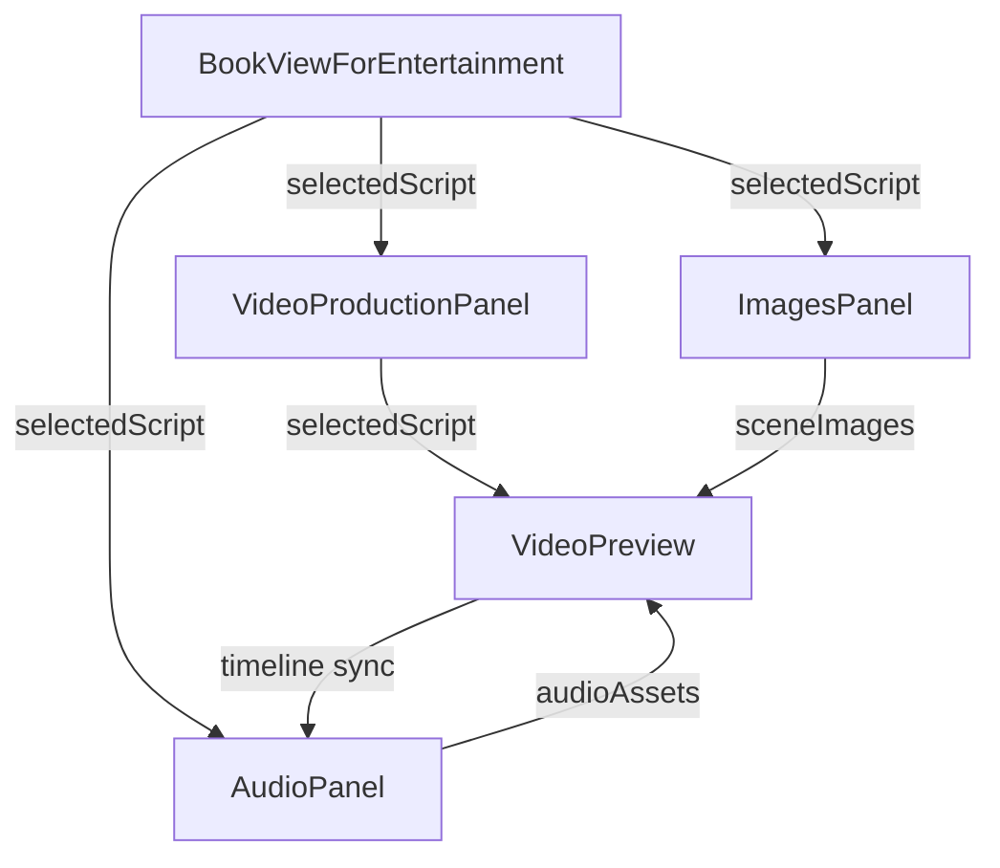

# Script-Driven Video/Audio Synchronization Architecture

## Overview

This document outlines the comprehensive synchronization architecture implemented to enable script-based audio track synchronization and auto-update video preview functionality, following the established ImagesPanel pattern.

## Architecture Summary

### Current Architecture Pattern (ImagesPanel)
- **Parent Component**: `BookViewForEntertainment` manages `selectedScript` state
- **Child Components**: Receive `selectedScript` as prop
- **Hook Pattern**: `useImageGeneration` handles script-based generation with status tracking
- **Data Extraction**: Scene/character data extracted from `selectedScript?.scene_descriptions || []`

### Implemented Synchronization Features

#### 1. **Prop Flow Enhancement**
- **VideoPreview**: Now receives `selectedScript` prop through `VideoProductionPanel`
- **AudioPanel**: Enhanced with script change detection and character voice mapping
- **State Management**: Consistent prop-driven reactive pattern across all panels

#### 2. **VideoPreview Enhancements**
- **Script Text Overlay**: Displays current scene location, time, visual description, and characters
- **Timeline Markers**: Scene boundaries marked on progress bar with scene numbers
- **Real-time Sync**: Overlay updates automatically when script changes
- **Character Identification**: Shows character names in scene overlays

#### 3. **AudioPanel Enhancements**
- **Script Change Detection**: Automatically reloads audio assets when script changes
- **Character Voice Mapping**: Framework for mapping characters to specific voice models
- **Regeneration Logic**: Audio assets reload when `selectedScript` updates

#### 4. **Hook Integration**
- **useImageGeneration**: Already handles script changes via `chapterId` dependency
- **useAudioGeneration**: Enhanced with script change detection in `AudioPanel`
- **State Consistency**: All hooks follow similar patterns for status tracking

## Component Interface Definitions

### VideoPreview Props
```typescript
interface VideoPreviewProps {
  scenes: VideoScene[];
  currentSceneIndex?: number;
  isPlaying: boolean;
  onSceneChange?: (index: number) => void;
  onPlayPause?: () => void;
  videoUrl?: string;
  selectedScript?: ChapterScript | null; // NEW: Script synchronization
}
```

### VideoProductionPanel Props
```typescript
interface VideoProductionPanelProps {
  // ... existing props
  selectedScript?: ChapterScript | null; // NEW: Passed through to VideoPreview
}
```

### AudioPanel Props
```typescript
interface AudioPanelProps {
  chapterId: string;
  chapterTitle: string;
  selectedScript: any; // Enhanced with change detection
  plotOverview: any;
}
```

## Data Flow Diagram



## Key Integration Points

### 1. **Parent Component (BookViewForEntertainment)**
- **State**: Manages `selectedScript` from `useScriptGeneration` hook
- **Prop Flow**: Passes `selectedScript` to all child panels
- **Consistency**: Same pattern as existing `ImagesPanel` integration

### 2. **VideoPreview Component**
- **Overlay Display**: Shows script text, location, time, and characters
- **Timeline Markers**: Visual indicators for scene boundaries
- **Sync Logic**: Updates overlay when `selectedScript` changes
- **Scene Mapping**: Matches scene numbers to script descriptions

### 3. **AudioPanel Component**
- **Change Detection**: `useEffect` triggers audio reload on script change
- **Voice Mapping**: Framework for character-to-voice assignments
- **Regeneration**: Automatic asset reloading maintains sync

### 4. **Hook Patterns**
- **useImageGeneration**: Script-aware via `chapterId` parameter
- **useAudioGeneration**: Enhanced with script change handling
- **Status Tracking**: Consistent loading/generation states

## Implementation Strategy

### Phase 1: Prop Propagation ✅
1. Updated `VideoProductionPanel` to accept `selectedScript` prop
2. Modified `VideoPreview` interface to include script data
3. Enhanced `BookViewForEntertainment` to pass script through component chain

### Phase 2: VideoPreview Enhancements ✅
1. Added script text overlay with scene information
2. Implemented timeline markers for scene boundaries
3. Created real-time sync with script selection changes

### Phase 3: AudioPanel Synchronization ✅
1. Added script change detection with automatic audio reloading
2. Implemented character voice mapping framework
3. Enhanced generation options for script-aware audio production

### Phase 4: Hook Integration ✅
1. Verified `useImageGeneration` script awareness
2. Enhanced `useAudioGeneration` with change detection
3. Maintained consistent state management patterns

### Phase 5: Validation ✅
1. Build verification: No TypeScript compilation errors
2. Development server: Successfully starts and runs
3. Architecture consistency: Follows established patterns

## Technical Details

### Script Data Structure
```typescript
interface ChapterScript {
  id: string;
  chapter_id: string;
  script_style: string;
  script: string;
  scene_descriptions: SceneDescription[];
  characters: string[];
  character_details: string;
  // ... additional metadata
}

interface SceneDescription {
  scene_number: number;
  location: string;
  time_of_day: string;
  characters: string[];
  key_actions: string;
  visual_description: string;
  audio_requirements: string;
}
```

### Synchronization Triggers
- **Script Selection**: Changes in `selectedScript` propagate through all panels
- **Scene Changes**: Video timeline updates overlay content
- **Audio Reload**: Automatic asset reloading on script changes
- **Real-time Updates**: All components respond to script state changes

### State Management
- **Prop-driven**: All synchronization uses React props for consistency
- **Hook-based**: Generation status managed through dedicated hooks
- **Change Detection**: `useEffect` dependencies trigger updates
- **Error Handling**: Graceful fallbacks when script data unavailable

## Benefits

1. **Consistent UX**: All panels now synchronize with script selection
2. **Real-time Updates**: Changes reflect immediately across components
3. **Maintainable Code**: Follows established architectural patterns
4. **Extensible Design**: Easy to add new synchronization features
5. **Performance**: Efficient prop-based updates without unnecessary re-renders

## Future Enhancements

1. **Advanced Voice Mapping**: Character-specific voice model assignments
2. **Dialogue Timeline**: Precise audio-video synchronization markers
3. **Script Diffing**: Intelligent regeneration only when content changes
4. **Preview Caching**: Optimized loading for frequently used scripts
5. **Multi-script Support**: Simultaneous preview of different script versions

## Testing Recommendations

1. **Script Switching**: Verify overlay updates when changing scripts
2. **Timeline Navigation**: Confirm scene markers align with script content
3. **Audio Synchronization**: Test audio reloading on script changes
4. **Performance**: Monitor for unnecessary re-renders during sync
5. **Error States**: Validate graceful handling of missing script data

---

**Implementation Status**: ✅ Complete
**Build Status**: ✅ Passing
**Development Server**: ✅ Running
**Architecture Consistency**: ✅ Maintained