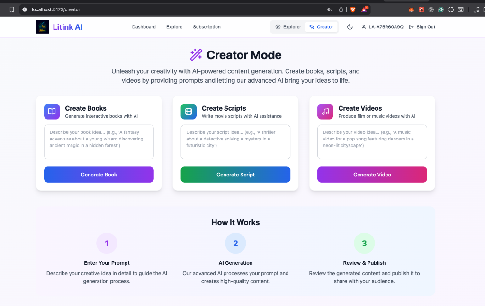
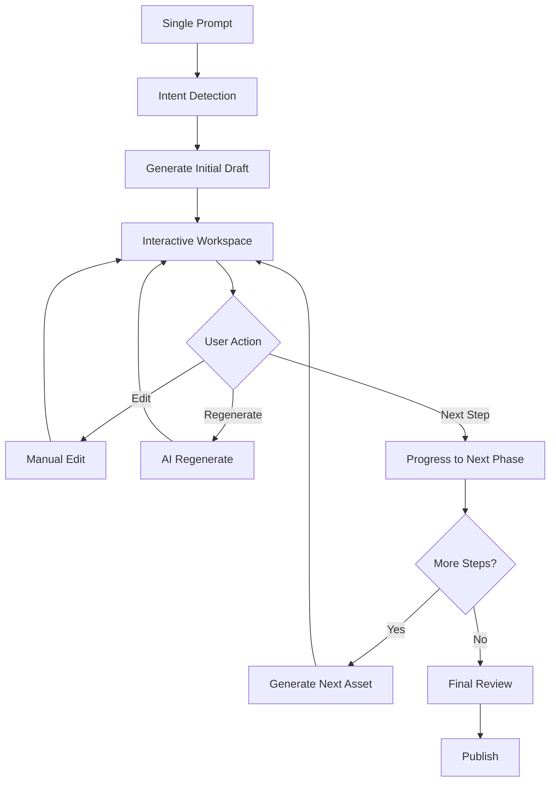

# Unified Content Generation Strategy

## Overview

This document outlines a comprehensive strategy for consolidating the three separate content creation paths (Books, Scripts, Videos) into a unified, intelligent workflow that adapts based on user intent and role (Explorer vs Creator).

---

## Current State Analysis

### Existing Implementation

**Creator Mode** (Current)
- 3 separate prompt fields for Books, Scripts, and Videos
- Simple prompt → generate → done workflow
- No guided workflow or iteration
- Location: `/creator` route

**Explorer Mode** (Current)
- Tabbed workflow: Plot → Script → Images → Audio → Video
- Manual step-by-step progression
- Each tab requires user action to proceed
- Applied only to entertainment books after upload

### Key Issues
1. **Fragmented UX**: Users must decide upfront what they want to create
2. **Rigid Workflow**: Explorer tabs are sequential but not automated
3. **Unclear Intent Detection**: System doesn't infer what output user wants
4. **Disconnected Paths**: Creator and Explorer don't share generation logic

---

## Proposed Architecture

### 1. **Unified Prompt Interface**

````carousel


**Current**: Three separate cards with separate prompts for Books, Scripts, and Videos

<!-- slide -->

**Proposed**: Single smart prompt field with:
- File upload capability (drag & drop)
- Multi-line rich text prompt area
- Intent detection badges (auto-detected: 📖 Book, 🎬 Script, 🎥 Video, 🎵 Audio)
- Output format selector (manual override)
- Advanced options (expandable)

````

### 2. **Intent Detection System**

#### Smart Analysis Engine
The system analyzes user input to determine intent:

```typescript
interface IntentAnalysis {
  primaryIntent: 'book' | 'script' | 'video' | 'audio' | 'comic' | 'animation';
  secondaryOutputs: string[];  // e.g., ['images', 'audio']
  workflowType: 'full' | 'partial';
  suggestedPipeline: WorkflowStep[];
}
```

#### Detection Rules

| Input Type | Indicators | Detected Intent |
|------------|-----------|-----------------|
| **Prompt** | "create a book", "story about", "novel" | Book → Full Pipeline |
| **Prompt** | "script for", "screenplay", "dialogue" | Script → Images → Video |
| **Prompt** | "music video", "advert", "animation" | Video (Script → Images → Audio → Video) |
| **Upload** | `.pdf`, `.epub`, `.txt` | Book/Document → Generate Assets |
| **Upload** | `.docx` with screenplay format | Script → Generate Video |
| **Prompt** | "character design for", "comic book" | Comic (Plot → Script → Images) |

### 3. **Dual Workflow System**

---

## Explorer Mode: Fully Agentic Pipeline

> [!IMPORTANT]
> **Use Case**: Users who want to upload content and get automated output without manual intervention.

### Architecture


### Implementation Strategy

#### Backend: Celery Task Chain

```python
# backend/app/tasks/agentic_workflow.py

@celery.task
def agentic_content_pipeline(
    user_id: str,
    content_input: dict,  # prompt or file_url
    intent: str,
    options: dict
):
    """
    Fully automated content generation pipeline for Explorer mode
    """
    # Step 1: Create project record
    project = create_project(user_id, intent, options)
    
    # Step 2: Chain tasks based on intent
    if intent == 'video':
        workflow = chain(
            generate_plot.s(project.id, content_input),
            generate_script.s(project.id),
            generate_character_images.s(project.id),
            generate_scene_images.s(project.id),
            generate_audio.s(project.id),
            assemble_video.s(project.id),
            notify_completion.s(user_id, project.id)
        )
    elif intent == 'book':
        workflow = chain(
            generate_chapters.s(project.id, content_input),
            generate_cover.s(project.id),
            generate_illustrations.s(project.id),
            format_book.s(project.id),
            notify_completion.s(user_id, project.id)
        )
    
    # Execute asynchronously
    workflow.apply_async()
    
    return project.id
```

#### Frontend: Progress Monitoring

```typescript
// frontend/src/pages/ExplorerGeneration.tsx

function AgenticPipeline({ projectId }: { projectId: string }) {
  const { status, progress, currentStep, outputs } = useAgenticWorkflow(projectId);
  
  return (
    <div className="pipeline-view">
      <ProgressBar steps={progress.steps} currentStep={currentStep} />
      <LiveFeed events={progress.events} />
      <OutputPreview outputs={outputs} />
      {status === 'completed' && <PublishButton projectId={projectId} />}
    </div>
  );
}
```

---

## Creator Mode: Human-in-the-Loop Workflow

> [!IMPORTANT]
> **Use Case**: Creators who want AI assistance but need control over the creative process.

### Architecture



### Implementation Strategy

#### Workflow Orchestrator

```typescript
// frontend/src/components/Creator/WorkflowOrchestrator.tsx

interface WorkflowState {
  currentPhase: 'plot' | 'script' | 'images' | 'audio' | 'video';
  artifacts: {
    plot?: PlotOverview;
    scripts?: Script[];
    images?: Image[];
    audio?: AudioFile[];
    videos?: Video[];
  };
  userEdits: Map<string, any>;
  agentSuggestions: Suggestion[];
}

function CreatorWorkflow() {
  const [workflow, setWorkflow] = useState<WorkflowState>({
    currentPhase: 'plot',
    artifacts: {},
    userEdits: new Map(),
    agentSuggestions: []
  });
  
  const handleAIAssistRequest = async (instruction: string) => {
    // User: "Make the villain more menacing"
    const result = await api.requestAgentEdit({
      phase: workflow.currentPhase,
      artifact: workflow.artifacts[workflow.currentPhase],
      instruction: instruction,
      context: workflow.artifacts // Full context for coherence
    });
    
    // Show diff and let user accept/reject
    showDiffModal(result);
  };
  
  return (
    <Split>
      <LeftPanel>
        <PhaseNavigation phases={workflow.phases} current={workflow.currentPhase} />
        <ArtifactEditor artifact={currentArtifact} onEdit={handleManualEdit} />
      </LeftPanel>
      
      <RightPanel>
        <AIAssistant onRequest={handleAIAssistRequest} />
        <SuggestionsPanel suggestions={workflow.agentSuggestions} />
      </RightPanel>
    </Split>
  );
}
```

#### Backend: Agent-Assisted Editing

```python
# backend/app/api/routes/creator/agent.py

@router.post("/agent/edit")
async def agent_edit_request(
    phase: str,
    artifact_id: str,
    instruction: str,
    context: dict,
    user: User = Depends(get_current_user)
):
    """
    Process creator's natural language edit request
    Uses LLM to interpret and apply changes
    """
    # Get current artifact
    artifact = await get_artifact(artifact_id)
    
    # Use LLM with context to make intelligent edits
    prompt = f"""
    You are helping a creator refine their {phase}.
    
    Current content:
    {artifact.content}
    
    Full context:
    {json.dumps(context)}
    
    User instruction: {instruction}
    
    Generate an updated version that:
    1. Applies the requested change
    2. Maintains consistency with existing content
    3. Preserves the creative vision
    
    Return ONLY the modified sections with before/after.
    """
    
    result = await llm_service.generate(prompt)
    
    # Parse into diff format
    diff = create_diff(artifact.content, result.modified)
    
    return {
        "diff": diff,
        "preview": result.modified,
        "agent_notes": result.reasoning
    }
```

---

## Unified Component Architecture

### Project Model

```python
# backend/app/models/project.py

class Project(SQLModel, table=True):
    """
    Unified project for any content type
    """
    id: str = Field(default_factory=lambda: str(uuid4()))
    user_id: str = Field(foreign_key="user.id")
    
    # Intent & Type
    project_type: str  # 'book', 'script', 'video', 'comic', 'animation'
    workflow_mode: str  # 'agentic' (explorer) or 'assisted' (creator)
    
    # Input
    input_prompt: Optional[str]
    input_files: List[str] = Field(default_factory=list)
    
    # Pipeline Config
    pipeline_steps: List[str]  # ['plot', 'script', 'images', 'audio', 'video']
    current_step: str
    
    # Status
    status: str  # 'draft', 'generating', 'review', 'completed', 'published'
    progress: float  # 0.0 to 1.0
    
    # Artifacts (polymorphic relationships)
    artifacts: List["Artifact"] = Relationship(back_populates="project")
    
    # Metadata
    created_at: datetime
    updated_at: datetime


class Artifact(SQLModel, table=True):
    """
    Generic artifact - can be plot, script, image, audio, video
    """
    id: str = Field(default_factory=lambda: str(uuid4()))
    project_id: str = Field(foreign_key="project.id")
    
    artifact_type: str  # 'plot', 'script', 'image', 'audio', 'video'
    version: int
    
    # Content (JSON for flexibility)
    content: dict  # Structure varies by type
    
    # Generation metadata
    generated_by: str  # 'ai' or 'user'
    generation_method: Optional[str]
    parent_artifact_id: Optional[str]  # For versioning
    
    # Status
    status: str  # 'draft', 'final', 'archived'
    
    created_at: datetime
```

### Unified API Endpoints

```python
# backend/app/api/routes/unified_creation/routes.py

@router.post("/projects/create")
async def create_project(
    request: CreateProjectRequest,
    user: User = Depends(get_current_user)
):
    """
    Single endpoint to create any type of content
    """
    # Analyze intent
    intent = await intent_analyzer.analyze(
        prompt=request.prompt,
        files=request.files,
        user_preferences=user.preferences
    )
    
    # Create project
    project = Project(
        user_id=user.id,
        project_type=intent.primary_intent,
        workflow_mode='agentic' if user.is_explorer else 'assisted',
        input_prompt=request.prompt,
        input_files=request.files,
        pipeline_steps=intent.suggested_pipeline,
        current_step=intent.suggested_pipeline[0],
        status='draft'
    )
    
    await db.save(project)
    
    # Start workflow
    if project.workflow_mode == 'agentic':
        # Fire and forget - full automation
        agentic_content_pipeline.delay(
            user_id=user.id,
            project_id=project.id,
            intent=intent
        )
    else:
        # Generate first step only, wait for user input
        await generate_first_step(project.id)
    
    return project


@router.post("/projects/{project_id}/advance")
async def advance_project(
    project_id: str,
    step: str,
    user_edits: Optional[dict] = None,
    agent_instruction: Optional[str] = None,
    user: User = Depends(get_current_user)
):
    """
    Advance project to next step (Creator mode)
    Optionally apply user edits or agent instructions
    """
    project = await get_project(project_id, user.id)
    
    if user_edits:
        # Save user's manual edits
        await save_artifact(project_id, step, user_edits, generated_by='user')
    
    if agent_instruction:
        # Process AI-assisted edit
        result = await agent_edit_request(
            phase=step,
            artifact_id=project.current_artifact_id,
            instruction=agent_instruction,
            context=await get_project_context(project_id)
        )
        # Return for user approval
        return {"type": "agent_suggestion", "result": result}
    
    # Move to next step
    next_step = get_next_step(project.pipeline_steps, step)
    await update_project(project_id, current_step=next_step)
    
    # Generate next phase
    await generate_step(project_id, next_step)
    
    return {"next_step": next_step}
```

---

## Frontend UI/UX Design

### Unified Creation Page

````carousel

**Entry Point**: Single page with smart input

```tsx
// frontend/src/pages/UnifiedCreation.tsx

function UnifiedCreation() {
  const [intent, setIntent] = useState<IntentAnalysis | null>(null);
  const [project, setProject] = useState<Project | null>(null);
  
  return (
    <div className="unified-creation">
      {!project ? (
        <CreationInput
          onAnalyze={(analysis) => setIntent(analysis)}
          onSubmit={handleCreateProject}
        />
      ) : user.role === 'explorer' ? (
        <AgenticPipelineView projectId={project.id} />
      ) : (
        <AssistedWorkflowView projectId={project.id} />
      )}
    </div>
  );
}
```

<!-- slide -->

**Smart Input Component**

```tsx
function CreationInput({ onAnalyze, onSubmit }) {
  const [input, setInput] = useState('');
  const [files, setFiles] = useState<File[]>([]);
  const [analysis, setAnalysis] = useState<IntentAnalysis | null>(null);
  
  const handleAnalyze = async () => {
    const result = await api.analyzeIntent({ prompt: input, files });
    setAnalysis(result);
    onAnalyze(result);
  };
  
  return (
    <Card>
      <TextArea
        placeholder="What do you want to create today? Describe your idea or upload a file..."
        value={input}
        onChange={(e) => setInput(e.target.value)}
        onBlur={handleAnalyze}
      />
      
      <FileUpload
        accept=".pdf,.epub,.txt,.docx,.doc"
        onUpload={setFiles}
      />
      
      {analysis && (
        <IntentBadges intents={analysis} />
      )}
      
      <OutputFormatSelector
        detected={analysis?.primaryIntent}
        onChange={(format) => setCustomIntent(format)}
      />
      
      <Button onClick={() => onSubmit({ input, files, analysis })}>
        {user.role === 'explorer' ? 'Generate Automatically' : 'Start Creating'}
      </Button>
    </Card>
  );
}
```

<!-- slide -->

**Creator Workspace**

```tsx
function AssistedWorkflowView({ projectId }) {
  const { project, currentArtifact } = useProject(projectId);
  const [agentPrompt, setAgentPrompt] = useState('');
  
  return (
    <div className="creator-workspace grid grid-cols-[1fr_400px]">
      {/* Main Canvas */}
      <div className="main-canvas">
        <PhaseTimeline
          phases={project.pipeline_steps}
          current={project.current_step}
        />
        
        <ArtifactEditor
          artifact={currentArtifact}
          onManualEdit={handleEdit}
          onSave={handleSave}
        />
        
        <Actions>
          <Button onClick={handlePrevious}>Previous Phase</Button>
          <Button onClick={handleNext} variant="primary">
            Generate Next Phase
          </Button>
        </Actions>
      </div>
      
      {/* AI Assistant Sidebar */}
      <div className="ai-assistant">
        <ChatInterface>
          <Input
            placeholder="Tell me what to change..."
            value={agentPrompt}
            onChange={(e) => setAgentPrompt(e.target.value)}
          />
          <Button onClick={() => handleAgentRequest(agentPrompt)}>
            Apply Change
          </Button>
        </ChatInterface>
        
        <Suggestions>
          {project.suggestions.map(s => (
            <SuggestionCard key={s.id} suggestion={s} onApply={applySuggestion} />
          ))}
        </Suggestions>
      </div>
    </div>
  );
}
```

````

---

## Migration Path

### Phase 1: Backend Unification
1. Create `Project` and `Artifact` models
2. Implement intent detection endpoint
3. Build unified creation endpoint
4. Migrate existing book/script/video endpoints to use new models

### Phase 2: Agentic Pipeline (Explorer)
1. Implement Celery task chains for each content type
2. Build progress tracking and notifications
3. Create agentic workflow UI
4. Test end-to-end automation

### Phase 3: Assisted Workflow (Creator)
1. Build agent-assisted editing endpoint
2. Implement diff/preview system
3. Create Creator workspace UI
4. Add chat-based AI assistant

### Phase 4: Replace Old UIs
1. Replace 3-card Creator page with unified input
2. Update Explorer tabs to use agentic mode
3. Add migration for existing projects
4. Deprecate old endpoints

---

## Key Benefits

### For Users

| Feature | Explorer Mode | Creator Mode |
|---------|--------------|--------------|
| **Speed** | ⚡ Fully automated, no waiting | 🎨 As fast as you need |
| **Control** | ❌ Fire and forget | ✅ Full control at each step |
| **Use Case** | Bulk content, prototypes | Polished, professional work |
| **AI Role** | 🤖 Autonomous agent | 🤝 Collaborative assistant |

### For Development

- **Single API**: One endpoint instead of three
- **Reusable Logic**: Pipeline steps shared across content types
- **Easier Maintenance**: Centralized intent detection and workflow
- **Scalable**: Add new content types (comics, animations) easily

---

## Technical Considerations

### Intent Detection Accuracy

> [!WARNING]
> **Challenge**: Misclassified intent leads to wrong pipeline.
>
> **Solution**: 
> - Always show detected intent with option to override
> - Learn from user corrections (track when users change detected intent)
> - A/B test different detection models

### Performance

> [!CAUTION]
> **Risk**: Agentic pipelines could take 10+ minutes for video generation.
>
> **Solution**:
> - Use Celery with Redis for async processing
> - WebSocket for real-time progress updates
> - Implement queue priority based on user tier
> - Cache intermediate results aggressively

### Error Handling

```python
# Robust error handling in agentic workflow

@celery.task(bind=True, max_retries=3)
def generate_step(self, project_id: str, step: str):
    try:
        result = await ai_service.generate(project_id, step)
        return result
    except RecoverableError as e:
        # Retry with exponential backoff
        raise self.retry(exc=e, countdown=2 ** self.request.retries)
    except UnrecoverableError as e:
        # Mark step as failed, notify user, allow manual intervention
        await mark_step_failed(project_id, step, error=str(e))
        await notify_user(project_id, f"Step {step} failed: {e}")
        # Don't fail entire pipeline - let user fix and resume
        return {"status": "failed", "error": str(e)}
```

---

## Next Steps

### Discussion Points

1. **Priority**: Should we build Explorer (agentic) or Creator (assisted) mode first?
2. **Intent Detection**: Use simple keyword matching or invest in ML model?
3. **Existing Users**: How to migrate current books/scripts to new Project model?
4. **UI Complexity**: Is the Creator workspace too complex? Should we simplify?

### Recommended Path

> [!TIP]
> **My Recommendation**: 
> 
> 1. **Start with Backend** - Build unified API in 1-2 weeks
> 2. **Explorer Mode First** - Simpler UX, bigger wow factor
> 3. **Iterate on Creator** - Get feedback, refine AI assistant
> 4. **Gradual Migration** - Keep old endpoints, slowly deprecate

Would you like me to:
- Create a detailed implementation plan?
- Build a prototype of the unified input component?
- Set up the backend Project model and migrations?
