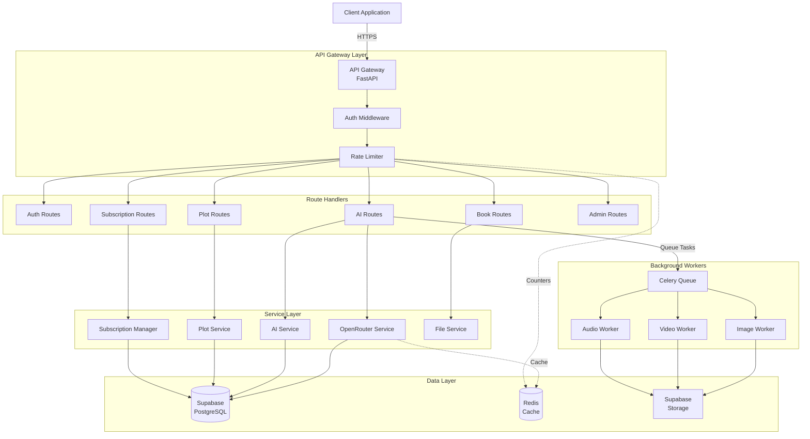

# API Specifications - LitinkAI Platform

Complete API documentation for all endpoints in the LitinkAI platform.

---

## Table of Contents

1. [API Overview](#api-overview)
2. [Authentication Endpoints](#authentication-endpoints)
3. [Books Management Endpoints](#books-management-endpoints)
4. [AI Generation Endpoints](#ai-generation-endpoints)
5. [Plot Management Endpoints](#plot-management-endpoints)
6. [Character Management Endpoints](#character-management-endpoints)
7. [Audio Generation Endpoints](#audio-generation-endpoints)
8. [Video Production Endpoints](#video-production-endpoints)
9. [Subscription Management Endpoints](#subscription-management-endpoints)
10. [Admin Endpoints](#admin-endpoints)
11. [Error Codes](#error-codes)
12. [Rate Limiting](#rate-limiting)

---

## API Overview

### Base URL

```
Production: https://api.litinkai.com/api/v1
Staging: https://staging-api.litinkai.com/api/v1
Development: http://localhost:8000/api/v1
```

### Authentication

All authenticated endpoints require a JWT token in the Authorization header:

```http
Authorization: Bearer <access_token>
```

### Response Format

All responses follow this structure:

```json
{
  "success": true,
  "data": { ... },
  "message": "Operation successful",
  "timestamp": "2025-11-06T18:00:00Z"
}
```

Error responses:

```json
{
  "success": false,
  "error": {
    "code": "VALIDATION_ERROR",
    "message": "Invalid input data",
    "details": { ... }
  },
  "timestamp": "2025-11-06T18:00:00Z"
}
```

---

## Authentication Endpoints

### Register User

**POST** `/auth/register`

Creates a new user account.

**Request Body:**
```json
{
  "email": "user@example.com",
  "password": "securePassword123!",
  "full_name": "John Doe",
  "agree_to_terms": true
}
```

**Response:** `201 Created`
```json
{
  "success": true,
  "data": {
    "user_id": "uuid-string",
    "email": "user@example.com",
    "full_name": "John Doe",
    "requires_verification": true,
    "created_at": "2025-11-06T18:00:00Z"
  }
}
```

**Errors:**
- `400` - Invalid email or weak password
- `409` - Email already registered

---

### Login

**POST** `/auth/login`

Authenticates user and returns JWT tokens.

**Request Body:**
```json
{
  "email": "user@example.com",
  "password": "securePassword123!"
}
```

**Response:** `200 OK`
```json
{
  "success": true,
  "data": {
    "access_token": "eyJhbGciOiJIUzI1NiIsInR5cCI6IkpXVCJ9...",
    "refresh_token": "eyJhbGciOiJIUzI1NiIsInR5cCI6IkpXVCJ9...",
    "token_type": "bearer",
    "expires_in": 3600,
    "user": {
      "user_id": "uuid-string",
      "email": "user@example.com",
      "full_name": "John Doe",
      "tier": "free"
    }
  }
}
```

**Errors:**
- `401` - Invalid credentials
- `403` - Email not verified

---

### Verify Email

**POST** `/auth/verify-email`

Verifies user email with token from email link.

**Query Parameters:**
- `token` (required): Verification token

**Response:** `200 OK`
```json
{
  "success": true,
  "data": {
    "verified": true,
    "message": "Email verified successfully"
  }
}
```

**Errors:**
- `400` - Invalid or expired token
- `404` - Token not found

---

### Refresh Token

**POST** `/auth/refresh`

Refreshes access token using refresh token.

**Request Body:**
```json
{
  "refresh_token": "eyJhbGciOiJIUzI1NiIsInR5cCI6IkpXVCJ9..."
}
```

**Response:** `200 OK`
```json
{
  "success": true,
  "data": {
    "access_token": "eyJhbGciOiJIUzI1NiIsInR5cCI6IkpXVCJ9...",
    "token_type": "bearer",
    "expires_in": 3600
  }
}
```

---

### Request Password Reset

**POST** `/auth/request-password-reset`

Sends password reset email.

**Request Body:**
```json
{
  "email": "user@example.com"
}
```

**Response:** `200 OK`
```json
{
  "success": true,
  "data": {
    "message": "Password reset email sent"
  }
}
```

---

### Reset Password

**POST** `/auth/reset-password`

Resets password using token from email.

**Request Body:**
```json
{
  "token": "reset-token-from-email",
  "new_password": "newSecurePassword123!"
}
```

**Response:** `200 OK`
```json
{
  "success": true,
  "data": {
    "message": "Password reset successfully"
  }
}
```

---

## Books Management Endpoints

### Upload Book

**POST** `/books/upload`

Uploads and processes a book file.

**Request:** `multipart/form-data`
- `file` (required): Book file (PDF, DOCX, EPUB, TXT)
- `book_type` (required): "learning" | "entertainment"
- `title` (optional): Custom book title
- `author` (optional): Book author

**Response:** `201 Created`
```json
{
  "success": true,
  "data": {
    "book_id": "uuid-string",
    "title": "Introduction to AI",
    "author": "John Smith",
    "book_type": "learning",
    "status": "processing",
    "file_url": "https://storage.supabase.co/...",
    "upload_date": "2025-11-06T18:00:00Z",
    "total_pages": 250,
    "estimated_chapters": 12
  }
}
```

**Errors:**
- `400` - Invalid file format
- `413` - File too large (max 50MB)
- `402` - Upload limit reached for tier

---

### Get Books

**GET** `/books`

Retrieves user's books.

**Query Parameters:**
- `book_type` (optional): Filter by type ("learning" | "entertainment")
- `status` (optional): Filter by status ("processing" | "ready" | "failed")
- `limit` (optional): Results per page (default: 20)
- `offset` (optional): Pagination offset (default: 0)

**Response:** `200 OK`
```json
{
  "success": true,
  "data": {
    "books": [
      {
        "book_id": "uuid-string",
        "title": "Introduction to AI",
        "author": "John Smith",
        "book_type": "learning",
        "status": "ready",
        "cover_image_url": "https://...",
        "total_chapters": 12,
        "upload_date": "2025-11-06T18:00:00Z"
      }
    ],
    "total": 5,
    "limit": 20,
    "offset": 0
  }
}
```

---

### Get Book Details

**GET** `/books/{book_id}`

Retrieves detailed book information with chapters.

**Response:** `200 OK`
```json
{
  "success": true,
  "data": {
    "book_id": "uuid-string",
    "title": "Introduction to AI",
    "author": "John Smith",
    "book_type": "learning",
    "status": "ready",
    "file_url": "https://...",
    "total_chapters": 12,
    "total_pages": 250,
    "chapters": [
      {
        "chapter_id": "uuid-string",
        "chapter_number": 1,
        "title": "What is AI?",
        "summary": "An introduction to artificial intelligence...",
        "content_preview": "In this chapter, we explore...",
        "word_count": 2500
      }
    ]
  }
}
```

**Errors:**
- `404` - Book not found
- `403` - Access denied

---

### Delete Book

**DELETE** `/books/{book_id}`

Deletes a book and all associated content.

**Response:** `200 OK`
```json
{
  "success": true,
  "data": {
    "message": "Book deleted successfully",
    "deleted_chapters": 12,
    "deleted_scripts": 5
  }
}
```

---

## AI Generation Endpoints

### Generate Script and Scenes

**POST** `/ai/generate-script-and-scenes`

Generates a video script with scene breakdowns.

**Request Body:**
```json
{
  "chapter_id": "uuid-string",
  "script_type": "educational" | "entertainment" | "documentary",
  "duration_minutes": 5,
  "style": "engaging" | "formal" | "casual",
  "include_plot_context": true,
  "custom_instructions": "Focus on visual examples"
}
```

**Response:** `201 Created`
```json
{
  "success": true,
  "data": {
    "script_id": "uuid-string",
    "title": "Understanding Neural Networks",
    "script_type": "educational",
    "duration_minutes": 5,
    "script_content": "Full script text...",
    "scenes": [
      {
        "scene_number": 1,
        "description": "Opening shot of human brain",
        "duration_seconds": 10,
        "dialogue": "The human brain is remarkable...",
        "characters": ["narrator"],
        "location": "Modern office",
        "time_of_day": "day"
      }
    ],
    "characters": [
      {
        "character_id": "uuid-string",
        "name": "Dr. Sarah Chen",
        "role": "Expert",
        "description": "A brilliant AI researcher..."
      }
    ],
    "estimated_cost": 0.50,
    "model_used": "gpt-4o",
    "created_at": "2025-11-06T18:00:00Z"
  }
}
```

**Errors:**
- `402` - Insufficient credits
- `400` - Invalid parameters
- `404` - Chapter not found

---

### Generate Entertainment Video

**POST** `/ai/generate-entertainment-video`

Initiates full video generation pipeline.

**Request Body:**
```json
{
  "script_id": "uuid-string",
  "quality": "standard" | "high" | "ultra",
  "aspect_ratio": "16:9" | "9:16" | "1:1",
  "voice_settings": {
    "narrator_voice_id": "voice-id",
    "speed": 1.0,
    "stability": 0.5
  },
  "image_style": "realistic" | "animated" | "cinematic",
  "include_lipsync": true
}
```

**Response:** `202 Accepted`
```json
{
  "success": true,
  "data": {
    "video_generation_id": "uuid-string",
    "status": "pending",
    "estimated_duration_minutes": 15,
    "steps": [
      {
        "step": "script_processing",
        "status": "pending"
      },
      {
        "step": "image_generation",
        "status": "pending",
        "estimated_images": 12
      },
      {
        "step": "audio_generation",
        "status": "pending"
      },
      {
        "step": "video_generation",
        "status": "pending"
      },
      {
        "step": "lipsync",
        "status": "pending"
      },
      {
        "step": "merge",
        "status": "pending"
      }
    ],
    "created_at": "2025-11-06T18:00:00Z"
  }
}
```

---

### Get Video Generation Status

**GET** `/ai/video-generation-status/{video_gen_id}`

Retrieves current status of video generation.

**Response:** `200 OK`
```json
{
  "success": true,
  "data": {
    "video_generation_id": "uuid-string",
    "status": "video_generation",
    "progress_percentage": 65,
    "current_step": "video_generation",
    "steps": [
      {
        "step": "script_processing",
        "status": "completed",
        "completed_at": "2025-11-06T18:01:00Z"
      },
      {
        "step": "image_generation",
        "status": "completed",
        "completed_at": "2025-11-06T18:05:00Z",
        "images_generated": 12,
        "images_failed": 0
      },
      {
        "step": "audio_generation",
        "status": "completed",
        "completed_at": "2025-11-06T18:07:00Z"
      },
      {
        "step": "video_generation",
        "status": "in_progress",
        "videos_completed": 7,
        "videos_total": 12
      }
    ],
    "estimated_completion": "2025-11-06T18:15:00Z",
    "preview_url": null
  }
}
```

**Status Values:**
- `pending` - Queued, not started
- `script_processing` - Processing script
- `image_generation` - Generating images
- `audio_generation` - Generating audio
- `video_generation` - Generating videos
- `lipsync` - Processing lip sync
- `merge` - Merging final video
- `completed` - Video ready
- `failed` - Generation failed

---

### Retry Video Generation

**POST** `/ai/retry-video-generation/{video_gen_id}`

Retries failed video generation from specific step.

**Request Body:**
```json
{
  "retry_from_step": "image_generation" | "audio_generation" | "video_generation" | "lipsync" | "merge",
  "retry_failed_only": true
}
```

**Response:** `200 OK`
```json
{
  "success": true,
  "data": {
    "video_generation_id": "uuid-string",
    "status": "image_generation",
    "retry_started": true,
    "retrying_items": 3
  }
}
```

---

### Get Pipeline Status

**GET** `/ai/pipeline-status/{video_gen_id}`

Retrieves detailed pipeline status for debugging.

**Response:** `200 OK`
```json
{
  "success": true,
  "data": {
    "video_generation_id": "uuid-string",
    "overall_status": "video_generation",
    "character_images": {
      "total": 4,
      "completed": 4,
      "failed": 0,
      "images": [
        {
          "character_id": "uuid-string",
          "character_name": "Dr. Sarah Chen",
          "status": "completed",
          "image_url": "https://..."
        }
      ]
    },
    "scene_images": {
      "total": 12,
      "completed": 12,
      "failed": 0
    },
    "audio_files": {
      "total": 12,
      "completed": 12,
      "failed": 0
    },
    "scene_videos": {
      "total": 12,
      "completed": 7,
      "in_progress": 5,
      "failed": 0
    },
    "tasks": [
      {
        "task_id": "celery-task-id",
        "task_type": "generate_scene_video",
        "status": "running",
        "started_at": "2025-11-06T18:10:00Z"
      }
    ]
  }
}
```

---

## Plot Management Endpoints

### Generate Plot Overview

**POST** `/plots/generate/{book_id}`

Generates comprehensive plot overview for a book.

**Request Body:**
```json
{
  "custom_instructions": "Focus on character development",
  "include_character_archetypes": true,
  "style": "detailed" | "concise"
}
```

**Response:** `201 Created`
```json
{
  "success": true,
  "data": {
    "plot_id": "uuid-string",
    "book_id": "uuid-string",
    "title": "Plot Analysis: Introduction to AI",
    "overview": "This educational book follows...",
    "themes": ["Innovation", "Ethics", "Future"],
    "story_arc": "Educational progression from basics to advanced",
    "characters": [
      {
        "character_id": "uuid-string",
        "name": "Dr. Sarah Chen",
        "role": "protagonist",
        "description": "A brilliant AI researcher...",
        "archetype": "The Sage",
        "personality_traits": ["intelligent", "curious", "patient"],
        "relationships": [
          {
            "related_character_id": "uuid-string",
            "relationship_type": "mentor",
            "description": "Guides students"
          }
        ]
      }
    ],
    "key_plot_points": [
      {
        "chapter_number": 1,
        "event": "Introduction to AI concepts",
        "significance": "Establishes foundation"
      }
    ],
    "created_at": "2025-11-06T18:00:00Z"
  }
}
```

---

### Get Plot Overview

**GET** `/plots/{book_id}`

Retrieves plot overview for a book.

**Response:** `200 OK`
```json
{
  "success": true,
  "data": {
    "plot_id": "uuid-string",
    "book_id": "uuid-string",
    "title": "Plot Analysis",
    "overview": "...",
    "characters": [...],
    "themes": [...],
    "created_at": "2025-11-06T18:00:00Z"
  }
}
```

---

## Character Management Endpoints

### Create Character

**POST** `/characters/create/{plot_id}`

Creates a new character for a plot.

**Request Body:**
```json
{
  "name": "Alex Martinez",
  "role": "supporting",
  "description": "A talented engineer with a passion for robotics",
  "personality_traits": ["innovative", "friendly", "determined"],
  "archetype": "The Hero"
}
```

**Response:** `201 Created`
```json
{
  "success": true,
  "data": {
    "character_id": "uuid-string",
    "plot_id": "uuid-string",
    "name": "Alex Martinez",
    "role": "supporting",
    "description": "A talented engineer...",
    "archetype": "The Hero",
    "personality_traits": ["innovative", "friendly", "determined"],
    "image_url": null,
    "created_at": "2025-11-06T18:00:00Z"
  }
}
```

---

### Generate Character Image

**POST** `/characters/{character_id}/generate-image`

Generates an image for a character.

**Request Body:**
```json
{
  "custom_prompt": "Portrait photo, professional attire, office background",
  "style": "realistic" | "animated" | "illustration",
  "aspect_ratio": "1:1"
}
```

**Response:** `202 Accepted`
```json
{
  "success": true,
  "data": {
    "task_id": "celery-task-id",
    "character_id": "uuid-string",
    "status": "pending",
    "estimated_completion": "2025-11-06T18:02:00Z"
  }
}
```

---

### Get Character

**GET** `/characters/{character_id}`

Retrieves character details.

**Response:** `200 OK`
```json
{
  "success": true,
  "data": {
    "character_id": "uuid-string",
    "name": "Dr. Sarah Chen",
    "role": "protagonist",
    "description": "A brilliant AI researcher...",
    "archetype": "The Sage",
    "personality_traits": ["intelligent", "curious", "patient"],
    "image_url": "https://...",
    "voice_id": "elevenlabs-voice-id",
    "relationships": [...],
    "appearances": [
      {
        "script_id": "uuid-string",
        "scene_numbers": [1, 3, 5, 7]
      }
    ]
  }
}
```

---

## Subscription Management Endpoints

### Get Current Subscription

**GET** `/subscriptions/current`

Retrieves user's current subscription details.

**Response:** `200 OK`
```json
{
  "success": true,
  "data": {
    "subscription_id": "uuid-string",
    "user_id": "uuid-string",
    "tier": "premium",
    "status": "active",
    "billing_cycle": "monthly",
    "current_period_start": "2025-11-01T00:00:00Z",
    "current_period_end": "2025-12-01T00:00:00Z",
    "cancel_at_period_end": false,
    "usage": {
      "scripts_generated": 45,
      "scripts_limit": 100,
      "videos_generated": 12,
      "videos_limit": 50,
      "storage_used_gb": 2.5,
      "storage_limit_gb": 10
    }
  }
}
```

---

### Create Checkout Session

**POST** `/subscriptions/checkout`

Creates Stripe checkout session for subscription.

**Request Body:**
```json
{
  "tier": "premium" | "professional",
  "billing_cycle": "monthly" | "annual",
  "success_url": "https://app.litinkai.com/success",
  "cancel_url": "https://app.litinkai.com/pricing"
}
```

**Response:** `200 OK`
```json
{
  "success": true,
  "data": {
    "session_id": "stripe-session-id",
    "checkout_url": "https://checkout.stripe.com/...",
    "expires_at": "2025-11-06T18:30:00Z"
  }
}
```

---

### Handle Stripe Webhook

**POST** `/subscriptions/webhook`

Handles Stripe webhook events (internal use).

**Headers:**
```
Stripe-Signature: stripe-signature-value
```

**Response:** `200 OK`

---

### Get Usage Statistics

**GET** `/subscriptions/usage`

Retrieves detailed usage statistics.

**Query Parameters:**
- `period` (optional): "current" | "last_month" | "last_year"

**Response:** `200 OK`
```json
{
  "success": true,
  "data": {
    "period": "current",
    "tier": "premium",
    "scripts": {
      "used": 45,
      "limit": 100,
      "percentage": 45
    },
    "videos": {
      "used": 12,
      "limit": 50,
      "percentage": 24
    },
    "storage": {
      "used_gb": 2.5,
      "limit_gb": 10,
      "percentage": 25
    },
    "cost_this_month": 12.50,
    "daily_usage": [
      {
        "date": "2025-11-01",
        "scripts": 3,
        "videos": 1,
        "cost": 0.85
      }
    ]
  }
}
```

---

## Admin Endpoints

### Get Cost Summary

**GET** `/admin/costs/summary`

**Admin Only** - Retrieves overall cost metrics.

**Query Parameters:**
- `start_date` (optional): Start date (ISO 8601)
- `end_date` (optional): End date (ISO 8601)

**Response:** `200 OK`
```json
{
  "success": true,
  "data": {
    "total_costs": 1250.50,
    "total_revenue": 2100.00,
    "profit_margin": 40.5,
    "by_service": {
      "openrouter": 850.30,
      "modelslab": 250.20,
      "elevenlabs": 150.00
    },
    "by_tier": {
      "free": -50.00,
      "basic": 150.00,
      "standard": 300.00,
      "premium": 450.00,
      "professional": 400.00
    }
  }
}
```

---

### Get Model Performance

**GET** `/admin/models/performance`

**Admin Only** - Retrieves AI model performance metrics.

**Response:** `200 OK`
```json
{
  "success": true,
  "data": {
    "models": [
      {
        "model_name": "gpt-4o",
        "total_requests": 1250,
        "success_rate": 98.5,
        "avg_latency_ms": 2500,
        "avg_cost_per_request": 0.05,
        "fallback_rate": 1.5
      }
    ]
  }
}
```

---

## Error Codes

| Code | HTTP Status | Description |
|------|-------------|-------------|
| `VALIDATION_ERROR` | 400 | Invalid request data |
| `AUTHENTICATION_ERROR` | 401 | Invalid or missing token |
| `INSUFFICIENT_PERMISSIONS` | 403 | User lacks required permissions |
| `RESOURCE_NOT_FOUND` | 404 | Requested resource not found |
| `RATE_LIMIT_EXCEEDED` | 429 | Too many requests |
| `USAGE_LIMIT_EXCEEDED` | 402 | Tier usage limit reached |
| `INTERNAL_SERVER_ERROR` | 500 | Server error |
| `SERVICE_UNAVAILABLE` | 503 | External service unavailable |

---

## Rate Limiting

Rate limits are enforced per tier:

| Tier | Requests/Minute | Requests/Hour | Requests/Day |
|------|----------------|---------------|--------------|
| Free | 10 | 100 | 1,000 |
| Basic | 30 | 500 | 5,000 |
| Standard | 60 | 1,000 | 10,000 |
| Premium | 120 | 2,000 | 20,000 |
| Professional | 300 | 5,000 | Unlimited |

**Rate Limit Headers:**
```
X-RateLimit-Limit: 60
X-RateLimit-Remaining: 45
X-RateLimit-Reset: 1699290000
```

---

## API Diagram



---

## References

- [FastAPI Documentation](https://fastapi.tiangolo.com/)
- [OpenAPI Specification](https://swagger.io/specification/)
- [REST API Best Practices](https://restfulapi.net/)
- [Main Architecture README](README.md)

---

**Last Updated**: 2025-11-06  
**Version**: 1.0  
**API Version**: v1  
**Maintained By**: API Team