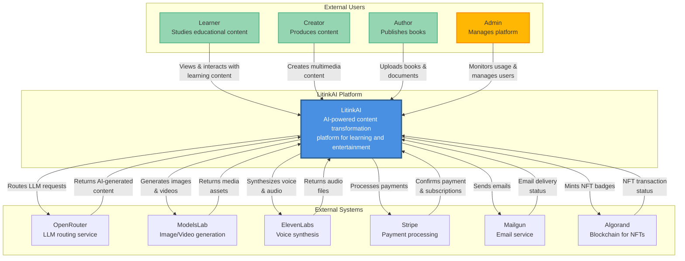
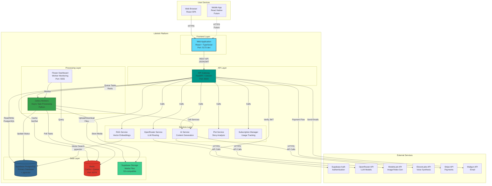
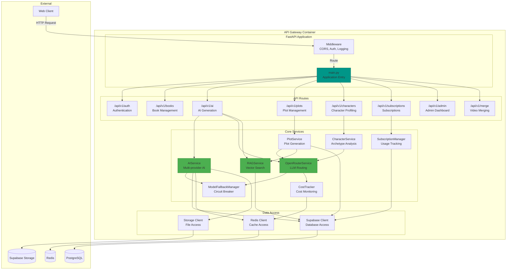
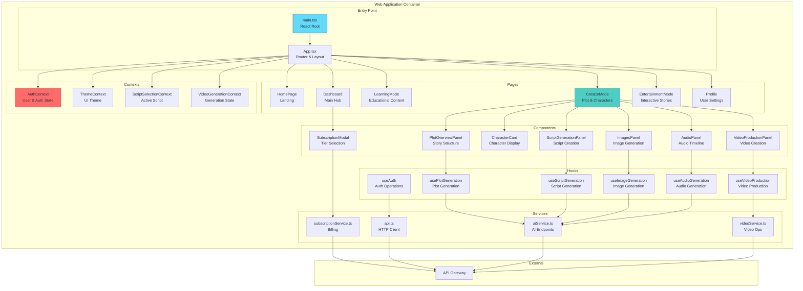
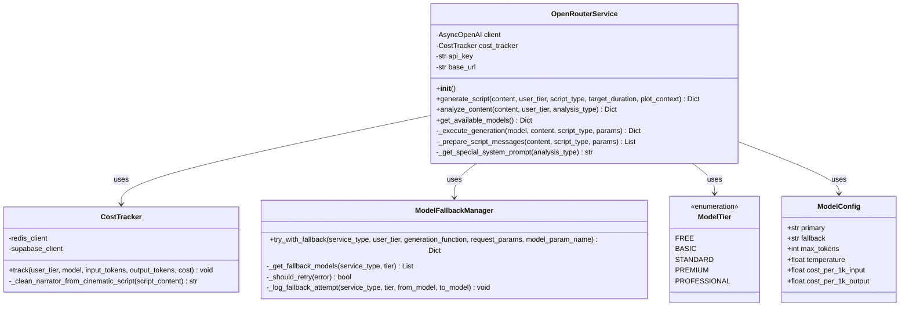
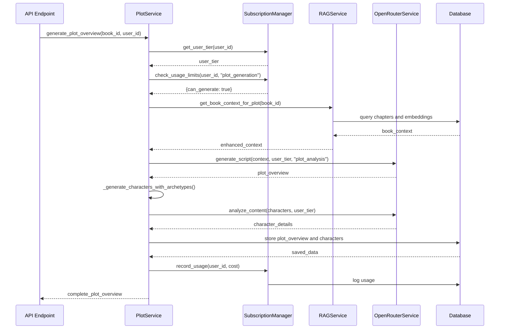
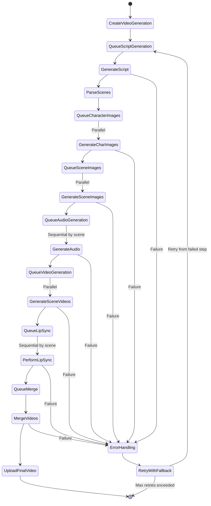

# C4 Model Diagrams - LitinkAI Platform

The C4 model provides a hierarchical view of the LitinkAI platform architecture across four levels: Context, Container, Component, and Code.

---

## Table of Contents

1. [Level 1: System Context](#level-1-system-context)
2. [Level 2: Container Diagram](#level-2-container-diagram)
3. [Level 3: Component Diagrams](#level-3-component-diagrams)
4. [Level 4: Code Diagrams](#level-4-code-diagrams)

---

## Level 1: System Context

The highest level view showing how LitinkAI fits into the overall ecosystem with external users and systems.

### Context Description

**Purpose**: Transform static text content (books, articles, documentation) into interactive multimedia experiences for learning, content creation, and entertainment.

**Primary Users**:
- **Learners**: Students consuming educational content with quizzes and interactive lessons
- **Creators**: Content creators using plot management and professional tools
- **Authors**: Book authors uploading and managing their publications
- **Admins**: Platform administrators monitoring usage and managing users

**External Dependencies**:
- **AI Services**: OpenRouter (LLM routing), ModelsLab (visual generation), ElevenLabs (voice)
- **Infrastructure**: Stripe (payments), Mailgun (email), Algorand (blockchain)

---

## Level 2: Container Diagram

Shows the high-level technology choices and how containers communicate with each other.

### Container Descriptions

| Container | Technology | Purpose | Scaling |
|-----------|-----------|---------|---------|
| **Web Application** | React 18 + TypeScript + Vite | User interface for all three modes (Learning, Creator, Entertainment) | Horizontal via CDN |
| **API Gateway** | FastAPI + Uvicorn | RESTful API, authentication, request routing | Horizontal behind load balancer |
| **Celery Workers** | Python + Celery | Asynchronous processing of AI tasks, video generation, merging | Horizontal by queue |
| **PostgreSQL** | Supabase PostgreSQL 15 + pgvector | Primary data store, vector embeddings for RAG | Vertical + read replicas |
| **Redis** | Redis 7 | Cache, session store, message broker | Vertical + Redis Cluster |
| **Supabase Storage** | S3-compatible object storage | Media files (videos, images, audio) | CDN caching |
| **Flower** | Celery monitoring tool | Worker health and task monitoring | Single instance |

### Communication Protocols

- **Frontend ↔ API**: HTTPS REST (JSON), WebSocket for real-time updates (future)
- **API ↔ Database**: PostgreSQL protocol (asyncpg)
- **API ↔ Redis**: Redis protocol (redis-py)
- **API ↔ Workers**: Redis as message broker
- **Workers ↔ External APIs**: HTTPS REST (JSON)

---

## Level 3: Component Diagrams

### 3.1: API Gateway Components

### 3.2: Celery Worker Components

```mermaid
graph TB
    subgraph "Celery Worker Container"
        subgraph "Task Modules"
            IMAGE_TASKS[image_tasks.py<br/>Character & Scene Images]
            VIDEO_TASKS[video_tasks.py<br/>Video Generation]
            AUDIO_TASKS[audio_tasks.py<br/>Audio Synthesis]
            MERGE_TASKS[merge_tasks.py<br/>Video Merging]
            LIPSYNC_TASKS[lipsync_tasks.py<br/>Lip Synchronization]
            BLOCKCHAIN_TASKS[blockchain_tasks.py<br/>NFT Minting]
        end
        
        subgraph "Worker Services"
            CELERY_APP[celery_app.py<br/>Celery Configuration]
            TASK_EXECUTOR[Task Executor<br/>Worker Process]
        end
        
        subgraph "Processing Services"
            MODELSLAB_IMAGE[ModelsLabImageService<br/>Image Generation]
            MODELSLAB_VIDEO[ModelsLabVideoService<br/>Video Generation]
            ELEVENLABS[ElevenLabsService<br/>Audio Generation]
            FFMPEG[FFmpeg Wrapper<br/>Video Processing]
            ALGORAND[Algorand SDK<br/>Blockchain Ops]
        end
        
        subgraph "Data Access"
            DB_ACCESS[Database Access<br/>Supabase]
            STORAGE_ACCESS[Storage Access<br/>Upload/Download]
            CACHE_ACCESS[Cache Access<br/>Redis]
        end
    end
    
    subgraph "External"
        REDIS_QUEUE[(Redis Queue)]
        POSTGRES[(PostgreSQL)]
        STORAGE[(Supabase Storage)]
        MODELSLAB_API[ModelsLab API]
        ELEVENLABS_API[ElevenLabs API]
        ALGORAND_NET[Algorand Network]
    end
    
    %% Queue polling
    REDIS_QUEUE -->|Poll Tasks| TASK_EXECUTOR
    TASK_EXECUTOR --> IMAGE_TASKS
    TASK_EXECUTOR --> VIDEO_TASKS
    TASK_EXECUTOR --> AUDIO_TASKS
    TASK_EXECUTOR --> MERGE_TASKS
    TASK_EXECUTOR --> LIPSYNC_TASKS
    TASK_EXECUTOR --> BLOCKCHAIN_TASKS
    
    %% Task to Services
    IMAGE_TASKS --> MODELSLAB_IMAGE
    VIDEO_TASKS --> MODELSLAB_VIDEO
    AUDIO_TASKS --> ELEVENLABS
    MERGE_TASKS --> FFMPEG
    LIPSYNC_TASKS --> FFMPEG
    BLOCKCHAIN_TASKS --> ALGORAND
    
    %% Services to External APIs
    MODELSLAB_IMAGE --> MODELSLAB_API
    MODELSLAB_VIDEO --> MODELSLAB_API
    ELEVENLABS --> ELEVENLABS_API
    ALGORAND --> ALGORAND_NET
    
    %% Data access
    IMAGE_TASKS --> DB_ACCESS
    VIDEO_TASKS --> DB_ACCESS
    AUDIO_TASKS --> DB_ACCESS
    MERGE_TASKS --> DB_ACCESS
    
    IMAGE_TASKS --> STORAGE_ACCESS
    VIDEO_TASKS --> STORAGE_ACCESS
    AUDIO_TASKS --> STORAGE_ACCESS
    MERGE_TASKS --> STORAGE_ACCESS
    
    IMAGE_TASKS --> CACHE_ACCESS
    
    %% External data
    DB_ACCESS --> POSTGRES
    STORAGE_ACCESS --> STORAGE
    CACHE_ACCESS --> REDIS_QUEUE
    
    style CELERY_APP fill:#37A14C,stroke:#1D5E26
    style IMAGE_TASKS fill:#8BC34A,stroke:#558B2F
    style VIDEO_TASKS fill:#8BC34A,stroke:#558B2F
    style AUDIO_TASKS fill:#8BC34A,stroke:#558B2F
```

### 3.3: Frontend Components

---

## Level 4: Code Diagrams

### 4.1: OpenRouter Service Class Structure

### 4.2: Plot Service Flow

### 4.3: Video Generation Pipeline Code Flow

---

## Diagram Legend

### Node Colors

- **Blue (#4A90E2)**: Core System/Platform
- **Green (#95D5B2)**: Users
- **Orange (#FFB703)**: Admin/Special Users
- **Teal (#009688)**: API Services
- **Green (#37A14C)**: Workers/Background Processes
- **Dark Blue (#336791)**: Databases
- **Red (#DC382D)**: Cache/Queue
- **Light Green (#3ECF8E)**: Storage

### Arrow Types

- **Solid Arrow (→)**: Synchronous call/request
- **Dashed Arrow (⇢)**: Asynchronous call/message
- **Thick Arrow (⟹)**: Data flow

---

## Key Architectural Patterns

### 1. **Microservices Pattern**
- Services are loosely coupled
- Each service has a single responsibility
- Services communicate via well-defined APIs

### 2. **Event-Driven Architecture**
- Celery tasks for async processing
- Redis as message broker
- Event-driven state updates

### 3. **Circuit Breaker Pattern**
- ModelFallbackManager implements circuit breaker
- Automatic model switching on failure
- Prevents cascading failures

### 4. **Repository Pattern**
- Data access abstracted through clients
- Services don't directly access database
- Centralized data access logic

### 5. **Strategy Pattern**
- Different AI providers (OpenAI, DeepSeek, OpenRouter)
- Interchangeable implementations
- Runtime provider selection

---

## References

- [C4 Model Documentation](https://c4model.com/)
- [Mermaid Diagram Syntax](https://mermaid.js.org/)
- [Main Architecture README](README.md)
- [UML Diagrams](UML-DIAGRAMS.md)

---

**Last Updated**: 2025-11-06  
**Version**: 1.0  
**Maintained By**: Architecture Team