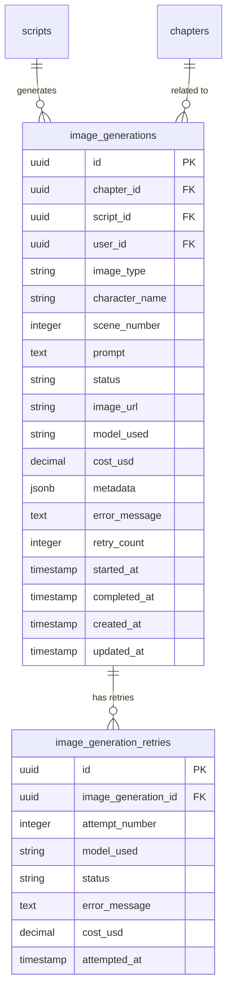
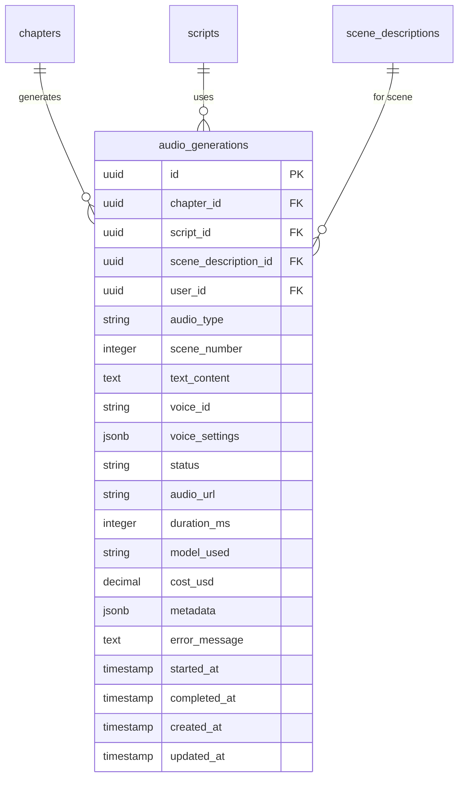
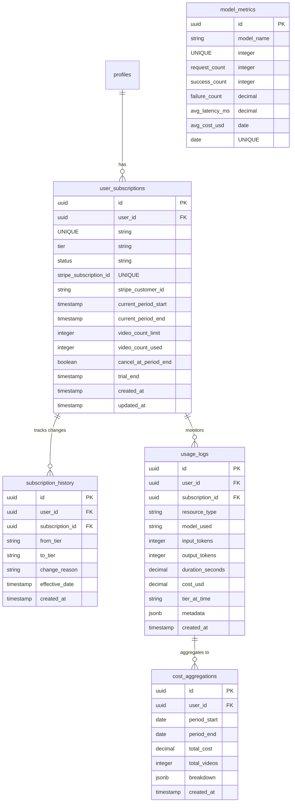

# Entity Relationship Diagram (ERD) - LitinkAI Platform

This document provides comprehensive Entity Relationship Diagrams for the LitinkAI platform database schema using Supabase PostgreSQL with pgvector extension.

---

## Table of Contents

1. [Complete Database Schema](#complete-database-schema)
2. [Core Domain Models](#core-domain-models)
3. [Plot & Character Models](#plot--character-models)
4. [Media Generation Models](#media-generation-models)
5. [Subscription & Usage Models](#subscription--usage-models)
6. [Gamification Models](#gamification-models)
7. [Table Definitions](#table-definitions)
8. [Indexes & Constraints](#indexes--constraints)

---

## Complete Database Schema

### Overall System ERD

```mermaid
erDiagram
    %% Authentication & Users
    users ||--o{ profiles : has
    profiles ||--o{ user_roles : has
    profiles ||--o{ books : creates
    profiles ||--o{ user_subscriptions : has
    profiles ||--o{ usage_logs : generates
    profiles ||--o{ badges : earns
    profiles ||--o{ nfts : owns
    
    %% Content Hierarchy
    books ||--o{ chapters : contains
    chapters ||--o{ scripts : has
    scripts ||--o{ scene_descriptions : contains
    scripts ||--o{ image_generations : generates
    scripts ||--o{ audio_generations : generates
    scripts ||--o{ video_generations : generates
    
    %% Plot System
    books ||--o{ plot_overviews : has
    plot_overviews ||--o{ characters : contains
    characters ||--o{ character_archetypes : uses
    scripts ||--o{ chapter_scripts : enhances
    
    %% Media Pipeline
    video_generations ||--o{ scene_videos : produces
    video_generations ||--o{ merge_jobs : requires
    merge_jobs ||--o{ merge_assets : uses
    
    %% Subscriptions
    user_subscriptions ||--o{ subscription_history : tracks
    user_subscriptions ||--o{ usage_logs : monitors
    usage_logs ||--o{ cost_aggregations : aggregates
    
    users {
        uuid id PK
        string email UNIQUE
        string encrypted_password
        timestamp email_confirmed_at
        timestamp last_sign_in_at
        jsonb raw_app_meta_data
        jsonb raw_user_meta_data
        timestamp created_at
        timestamp updated_at
    }
    
    profiles {
        uuid id PK FK
        string email UNIQUE
        string display_name
        string avatar_url
        jsonb roles
        string user_mode
        boolean onboarding_complete
        timestamp created_at
        timestamp updated_at
    }
    
    books {
        uuid id PK
        uuid user_id FK
        string title
        string description
        string book_type
        string structure_type
        string status
        string file_url
        string cover_url
        integer total_chapters
        timestamp created_at
        timestamp updated_at
    }
    
    chapters {
        uuid id PK
        uuid book_id FK
        integer chapter_number
        string title
        text content
        text summary
        integer duration
        jsonb ai_content
        timestamp created_at
        timestamp updated_at
    }
```

---

## Core Domain Models

### User & Authentication Schema

```mermaid
erDiagram
    users ||--|| profiles : "has profile"
    profiles ||--o{ user_roles : "has many roles"
    profiles ||--o{ email_verifications : "tracks verification"
    
    users {
        uuid id PK
        string email UNIQUE
        string encrypted_password
        timestamp email_confirmed_at
        timestamp last_sign_in_at
        jsonb raw_app_meta_data
        jsonb raw_user_meta_data
        timestamp created_at
        timestamp updated_at
    }
    
    profiles {
        uuid id PK FK
        string email UNIQUE
        string display_name
        string avatar_url
        jsonb roles
        string user_mode
        boolean onboarding_complete
        timestamp created_at
        timestamp updated_at
    }
    
    user_roles {
        uuid id PK
        uuid user_id FK
        string role_name
        timestamp granted_at
        uuid granted_by FK
    }
    
    email_verifications {
        uuid id PK
        uuid user_id FK
        string token UNIQUE
        timestamp expires_at
        boolean verified
        timestamp verified_at
        timestamp created_at
    }
```

### Content Management Schema

```mermaid
erDiagram
    books ||--o{ chapters : "contains"
    books ||--o{ book_structure : "has structure"
    chapters ||--o{ scripts : "has scripts"
    chapters ||--o{ chapter_embeddings : "has embeddings"
    scripts ||--o{ scene_descriptions : "contains scenes"
    
    books {
        uuid id PK
        uuid user_id FK
        string title
        text description
        string book_type
        string structure_type
        string status
        string file_url
        string cover_url
        integer total_chapters
        jsonb metadata
        timestamp processing_started_at
        timestamp processing_completed_at
        timestamp created_at
        timestamp updated_at
    }
    
    book_structure {
        uuid id PK
        uuid book_id FK UNIQUE
        jsonb structure_data
        string extraction_method
        timestamp confirmed_at
        timestamp created_at
    }
    
    chapters {
        uuid id PK
        uuid book_id FK
        integer chapter_number
        string title
        text content
        text summary
        integer duration
        jsonb ai_content
        timestamp created_at
        timestamp updated_at
    }
    
    chapter_embeddings {
        uuid id PK
        uuid chapter_id FK UNIQUE
        vector embedding
        string embedding_model
        integer dimension
        timestamp created_at
    }
    
    scripts {
        uuid id PK
        uuid chapter_id FK
        uuid user_id FK
        string script_style
        text script
        text character_details
        integer scene_count
        string story_type
        uuid linked_script_id FK
        string status
        integer version
        timestamp created_at
        timestamp updated_at
    }
    
    scene_descriptions {
        uuid id PK
        uuid script_id FK
        integer scene_number
        string location
        string time_of_day
        jsonb characters
        text key_actions
        text visual_description
        text audio_requirements
        timestamp created_at
    }
```

---

## Plot & Character Models

### Plot System ERD

```mermaid
erDiagram
    books ||--o{ plot_overviews : "has plot"
    plot_overviews ||--o{ characters : "contains"
    characters }o--|| character_archetypes : "assigned"
    scripts ||--o{ chapter_scripts : "enhanced by plot"
    plot_overviews ||--o{ chapter_scripts : "enhances"
    
    plot_overviews {
        uuid id PK
        uuid book_id FK UNIQUE
        uuid user_id FK
        text logline
        jsonb themes
        string story_type
        string genre
        string tone
        string audience
        text setting
        string generation_method
        string model_used
        decimal generation_cost
        string status
        integer version
        timestamp created_at
        timestamp updated_at
    }
    
    characters {
        uuid id PK
        uuid plot_overview_id FK
        uuid book_id FK
        uuid user_id FK
        string name
        string role
        text character_arc
        text physical_description
        text personality
        jsonb archetypes
        text want
        text need
        text lie
        text ghost
        string image_url
        text image_generation_prompt
        jsonb image_metadata
        string generation_method
        string model_used
        timestamp created_at
        timestamp updated_at
    }
    
    character_archetypes {
        uuid id PK
        string name UNIQUE
        text description
        string category
        jsonb traits
        jsonb typical_roles
        text example_characters
        boolean is_active
        timestamp created_at
    }
    
    chapter_scripts {
        uuid id PK
        uuid chapter_id FK
        uuid plot_overview_id FK
        uuid script_id FK
        uuid user_id FK
        boolean plot_enhanced
        boolean character_enhanced
        jsonb scenes
        jsonb acts
        jsonb beats
        jsonb character_details
        jsonb character_arcs
        string status
        integer version
        jsonb generation_metadata
        timestamp created_at
        timestamp updated_at
    }
```

---

## Media Generation Models

### Image Generation ERD



### Audio Generation ERD



### Video Generation ERD

```mermaid
erDiagram
    scripts ||--o{ video_generations : "generates from"
    video_generations ||--o{ scene_videos : "produces"
    video_generations ||--o{ merge_jobs : "requires merge"
    scene_videos ||--o{ lipsync_jobs : "lip syncs"
    
    video_generations {
        uuid id PK
        uuid chapter_id FK
        uuid script_id FK
        uuid user_id FK
        string status
        integer progress_percentage
        string last_completed_step
        string current_step
        text error_message
        string video_url
        string quality_tier
        decimal total_cost_usd
        jsonb pipeline_metadata
        integer total_scenes
        integer completed_scenes
        timestamp started_at
        timestamp completed_at
        timestamp created_at
        timestamp updated_at
    }
    
    scene_videos {
        uuid id PK
        uuid video_generation_id FK
        integer scene_number
        string scene_video_url
        string lipsynced_video_url
        integer duration_ms
        string status
        string model_used
        decimal cost_usd
        jsonb metadata
        timestamp created_at
        timestamp updated_at
    }
    
    lipsync_jobs {
        uuid id PK
        uuid scene_video_id FK UNIQUE
        uuid video_generation_id FK
        uuid audio_generation_id FK
        string status
        string input_video_url
        string input_audio_url
        string output_video_url
        string model_used
        decimal cost_usd
        text error_message
        timestamp started_at
        timestamp completed_at
        timestamp created_at
    }
    
    merge_jobs {
        uuid id PK
        uuid video_generation_id FK UNIQUE
        uuid user_id FK
        string merge_type
        string status
        jsonb input_videos
        jsonb ffmpeg_params
        string output_video_url
        integer output_duration_ms
        integer output_size_bytes
        text error_message
        timestamp started_at
        timestamp completed_at
        timestamp created_at
        timestamp updated_at
    }
    
    merge_assets {
        uuid id PK
        uuid merge_job_id FK
        string asset_type
        string asset_url
        integer sequence_order
        jsonb transform_params
        timestamp created_at
    }
```

---

## Subscription & Usage Models

### Subscription System ERD



---

## Gamification Models

### Badges & NFTs ERD

```mermaid
erDiagram
    profiles ||--o{ user_badges : "earns"
    badges ||--o{ user_badges : "awarded to"
    profiles ||--o{ nfts : "owns"
    user_badges ||--|| nfts : "minted as"
    
    badges {
        uuid id PK
        string name UNIQUE
        text description
        string category
        string rarity
        string icon_url
        jsonb criteria
        integer xp_reward
        boolean is_active
        timestamp created_at
        timestamp updated_at
    }
    
    user_badges {
        uuid id PK
        uuid user_id FK
        uuid badge_id FK
        timestamp earned_at
        jsonb earning_context
        boolean displayed
        timestamp created_at
    }
    
    nfts {
        uuid id PK
        uuid user_id FK
        uuid user_badge_id FK
        string asset_id UNIQUE
        string blockchain
        string transaction_id
        string metadata_uri
        string image_uri
        jsonb attributes
        string status
        timestamp minted_at
        timestamp created_at
    }
    
    user_progress {
        uuid id PK
        uuid user_id FK UNIQUE
        integer total_xp
        integer level
        integer videos_created
        integer books_uploaded
        integer quizzes_completed
        decimal total_spent_usd
        jsonb achievements
        timestamp created_at
        timestamp updated_at
    }
```

---

## Table Definitions

### Core Tables Detail

#### users (Supabase Auth)
```sql
-- Managed by Supabase Auth
-- Located in auth.users schema
CREATE TABLE auth.users (
    id UUID PRIMARY KEY DEFAULT gen_random_uuid(),
    email VARCHAR(255) UNIQUE NOT NULL,
    encrypted_password VARCHAR(255),
    email_confirmed_at TIMESTAMPTZ,
    last_sign_in_at TIMESTAMPTZ,
    raw_app_meta_data JSONB,
    raw_user_meta_data JSONB,
    created_at TIMESTAMPTZ DEFAULT NOW(),
    updated_at TIMESTAMPTZ DEFAULT NOW()
);
```

#### profiles
```sql
CREATE TABLE profiles (
    id UUID PRIMARY KEY REFERENCES auth.users(id) ON DELETE CASCADE,
    email VARCHAR(255) UNIQUE NOT NULL,
    display_name VARCHAR(255),
    avatar_url TEXT,
    roles JSONB DEFAULT '["user"]'::jsonb,
    user_mode VARCHAR(50) DEFAULT 'learning',
    onboarding_complete BOOLEAN DEFAULT false,
    created_at TIMESTAMPTZ DEFAULT NOW(),
    updated_at TIMESTAMPTZ DEFAULT NOW(),
    
    CONSTRAINT valid_user_mode CHECK (user_mode IN ('learning', 'creator', 'entertainment'))
);

-- Row Level Security
ALTER TABLE profiles ENABLE ROW LEVEL SECURITY;

CREATE POLICY "Users can view own profile" ON profiles
    FOR SELECT USING (auth.uid() = id);

CREATE POLICY "Users can update own profile" ON profiles
    FOR UPDATE USING (auth.uid() = id);
```

#### books
```sql
CREATE TABLE books (
    id UUID PRIMARY KEY DEFAULT gen_random_uuid(),
    user_id UUID NOT NULL REFERENCES auth.users(id) ON DELETE CASCADE,
    title VARCHAR(500) NOT NULL,
    description TEXT,
    book_type VARCHAR(50) NOT NULL,
    structure_type VARCHAR(50) DEFAULT 'linear',
    status VARCHAR(50) DEFAULT 'draft',
    file_url TEXT,
    cover_url TEXT,
    total_chapters INTEGER DEFAULT 0,
    metadata JSONB DEFAULT '{}'::jsonb,
    processing_started_at TIMESTAMPTZ,
    processing_completed_at TIMESTAMPTZ,
    created_at TIMESTAMPTZ DEFAULT NOW(),
    updated_at TIMESTAMPTZ DEFAULT NOW(),
    
    CONSTRAINT valid_book_type CHECK (book_type IN ('learning', 'entertainment')),
    CONSTRAINT valid_status CHECK (status IN ('draft', 'processing', 'ready', 'failed'))
);

CREATE INDEX idx_books_user_id ON books(user_id);
CREATE INDEX idx_books_status ON books(status);
CREATE INDEX idx_books_created_at ON books(created_at DESC);
```

#### chapters
```sql
CREATE TABLE chapters (
    id UUID PRIMARY KEY DEFAULT gen_random_uuid(),
    book_id UUID NOT NULL REFERENCES books(id) ON DELETE CASCADE,
    chapter_number INTEGER NOT NULL,
    title VARCHAR(500) NOT NULL,
    content TEXT NOT NULL,
    summary TEXT,
    duration INTEGER, -- estimated reading time in minutes
    ai_content JSONB DEFAULT '{}'::jsonb,
    created_at TIMESTAMPTZ DEFAULT NOW(),
    updated_at TIMESTAMPTZ DEFAULT NOW(),
    
    CONSTRAINT unique_chapter_number UNIQUE(book_id, chapter_number)
);

CREATE INDEX idx_chapters_book_id ON chapters(book_id);
CREATE INDEX idx_chapters_number ON chapters(book_id, chapter_number);
```

---

## Indexes & Constraints

### Performance Indexes

```sql
-- User & Profile Indexes
CREATE INDEX idx_profiles_email ON profiles(email);
CREATE INDEX idx_profiles_roles ON profiles USING GIN(roles);

-- Book & Chapter Indexes
CREATE INDEX idx_books_user_type ON books(user_id, book_type);
CREATE INDEX idx_chapters_book_number ON chapters(book_id, chapter_number);

-- Script Indexes
CREATE INDEX idx_scripts_chapter_user ON scripts(chapter_id, user_id);
CREATE INDEX idx_scripts_status ON scripts(status) WHERE status = 'active';
CREATE INDEX idx_scene_descriptions_script ON scene_descriptions(script_id, scene_number);

-- Plot Indexes
CREATE INDEX idx_plot_overviews_book_user ON plot_overviews(book_id, user_id);
CREATE INDEX idx_characters_plot ON characters(plot_overview_id);
CREATE INDEX idx_characters_archetypes ON characters USING GIN(archetypes);

-- Media Generation Indexes
CREATE INDEX idx_image_gens_chapter ON image_generations(chapter_id, image_type);
CREATE INDEX idx_image_gens_status ON image_generations(status) WHERE status IN ('pending', 'in_progress');
CREATE INDEX idx_audio_gens_chapter ON audio_generations(chapter_id, audio_type);
CREATE INDEX idx_video_gens_status ON video_generations(status) WHERE status != 'completed';
CREATE INDEX idx_scene_videos_generation ON scene_videos(video_generation_id, scene_number);

-- Subscription Indexes
CREATE INDEX idx_subscriptions_user ON user_subscriptions(user_id);
CREATE INDEX idx_subscriptions_stripe ON user_subscriptions(stripe_subscription_id);
CREATE INDEX idx_usage_logs_user_date ON usage_logs(user_id, created_at DESC);
CREATE INDEX idx_usage_logs_resource ON usage_logs(resource_type, created_at DESC);

-- Vector Search Index (pgvector)
CREATE INDEX idx_chapter_embeddings_vector ON chapter_embeddings 
    USING ivfflat (embedding vector_cosine_ops)
    WITH (lists = 100);
```

### Foreign Key Constraints

```sql
-- Cascade deletes for user content
ALTER TABLE books ADD CONSTRAINT fk_books_user 
    FOREIGN KEY (user_id) REFERENCES auth.users(id) ON DELETE CASCADE;

ALTER TABLE chapters ADD CONSTRAINT fk_chapters_book 
    FOREIGN KEY (book_id) REFERENCES books(id) ON DELETE CASCADE;

ALTER TABLE scripts ADD CONSTRAINT fk_scripts_chapter 
    FOREIGN KEY (chapter_id) REFERENCES chapters(id) ON DELETE CASCADE;

-- Protect critical references
ALTER TABLE video_generations ADD CONSTRAINT fk_video_gen_script 
    FOREIGN KEY (script_id) REFERENCES scripts(id) ON DELETE RESTRICT;

-- Nullify optional references
ALTER TABLE chapter_scripts ADD CONSTRAINT fk_chapter_scripts_plot 
    FOREIGN KEY (plot_overview_id) REFERENCES plot_overviews(id) ON DELETE SET NULL;
```

### Check Constraints

```sql
-- Ensure valid enums
ALTER TABLE books ADD CONSTRAINT check_book_type 
    CHECK (book_type IN ('learning', 'entertainment'));

ALTER TABLE user_subscriptions ADD CONSTRAINT check_subscription_tier 
    CHECK (tier IN ('free', 'basic', 'standard', 'premium', 'professional', 'enterprise'));

ALTER TABLE image_generations ADD CONSTRAINT check_image_type 
    CHECK (image_type IN ('character', 'scene'));

-- Ensure logical values
ALTER TABLE video_generations ADD CONSTRAINT check_progress 
    CHECK (progress_percentage >= 0 AND progress_percentage <= 100);

ALTER TABLE chapters ADD CONSTRAINT check_positive_number 
    CHECK (chapter_number > 0);
```

---

## Row Level Security (RLS) Policies

### User Content Protection

```sql
-- Books: Users can only access their own books
CREATE POLICY "Users manage own books" ON books
    FOR ALL USING (auth.uid() = user_id);

-- Chapters: Access via book ownership
CREATE POLICY "Users access own book chapters" ON chapters
    FOR SELECT USING (
        EXISTS (
            SELECT 1 FROM books 
            WHERE books.id = chapters.book_id 
            AND books.user_id = auth.uid()
        )
    );

-- Scripts: Users manage their own scripts
CREATE POLICY "Users manage own scripts" ON scripts
    FOR ALL USING (auth.uid() = user_id);

-- Plot & Characters: Owner access only
CREATE POLICY "Users manage own plots" ON plot_overviews
    FOR ALL USING (auth.uid() = user_id);

CREATE POLICY "Users manage own characters" ON characters
    FOR ALL USING (auth.uid() = user_id);

-- Media Generations: Owner access via relationships
CREATE POLICY "Users access own image generations" ON image_generations
    FOR ALL USING (auth.uid() = user_id);

CREATE POLICY "Users access own video generations" ON video_generations
    FOR ALL USING (auth.uid() = user_id);

-- Subscriptions: User access only
CREATE POLICY "Users view own subscription" ON user_subscriptions
    FOR SELECT USING (auth.uid() = user_id);

-- Public access for reference data
CREATE POLICY "Anyone can view active archetypes" ON character_archetypes
    FOR SELECT USING (is_active = true);

CREATE POLICY "Anyone can view active badges" ON badges
    FOR SELECT USING (is_active = true);
```

---

## Database Statistics

### Current Schema Size Estimates

| Domain | Tables | Est. Rows/User | Storage Impact |
|--------|--------|----------------|----------------|
| **Core** | 5 | 50-100 | Low |
| **Plot** | 4 | 10-50 | Low |
| **Media** | 8 | 500-5000 | High (URLs only) |
| **Subscriptions** | 4 | 100-1000 | Medium |
| **Gamification** | 4 | 20-100 | Low |
| **Total** | **25** | **680-6250** | **Medium** |

*Note: Actual media files stored in Supabase Storage (S3), not in database*

---

## Migration Scripts

See individual migration files in [`backend/supabase/migrations/`](../backend/supabase/migrations/) and [`supabase/migrations/`](../supabase/migrations/).

Key migrations:
- `20251015_add_scene_fields_to_generations.sql`
- `20251015_add_multi_role_system_and_ownership_tracking.sql`
- `20251017_add_email_verification_system.sql`

---

## References

- [PostgreSQL Documentation](https://www.postgresql.org/docs/)
- [Supabase Database Guide](https://supabase.com/docs/guides/database)
- [pgvector Extension](https://github.com/pgvector/pgvector)
- [Main Architecture README](README.md)

---

**Last Updated**: 2025-11-06  
**Version**: 1.0  
**Schema Version**: 2.5 (based on migrations)