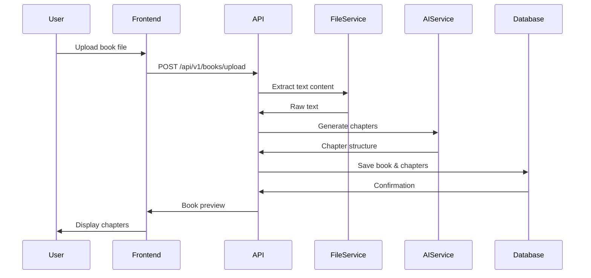
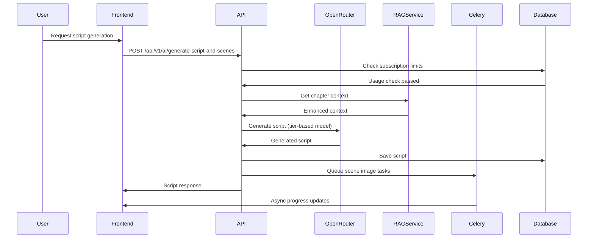
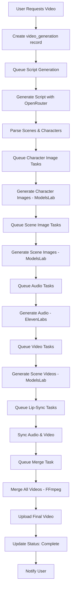
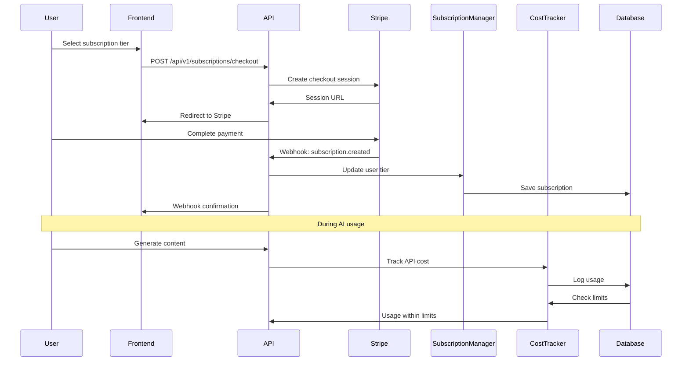

# LitinkAI Platform - Complete Software Architecture

## Executive Summary

LitinkAI is an AI-powered interactive platform that transforms books, articles, and documentation into engaging multimedia content for **learning**, **content creation**, and **entertainment**. The platform uses a microservices architecture with FastAPI backend, React frontend, and multiple AI services for content generation.

---

## Table of Contents

1. [System Overview](#system-overview)
2. [Architecture Principles](#architecture-principles)
3. [Technology Stack](#technology-stack)
4. [System Components](#system-components)
5. [Data Flow](#data-flow)
6. [Security Architecture](#security-architecture)
7. [Deployment Architecture](#deployment-architecture)
8. [Scaling Strategy](#scaling-strategy)
9. [Documentation Index](#documentation-index)

---

## System Overview

### Vision
Transform static text content into interactive, multimedia learning and entertainment experiences using AI.

### Core Capabilities
- **Content Ingestion**: Upload books (PDF, DOCX, EPUB), articles, or AI prompts
- **AI Processing**: Generate scripts, scenes, characters, and plot overviews
- **Multimedia Generation**: Create images, audio, video, and interactive elements
- **Three Modes**:
  - **Learning Mode**: Educational content with quizzes and interactive lessons
  - **Creator Mode**: Professional content creation tools with plot management
  - **Entertainment Mode**: Interactive storytelling with character-driven narratives

### Key Differentiators
- Book-first approach (vs. course-first like Coursera/Udemy)
- Multi-modal AI content generation
- Tiered subscription model with 40-80% profit margins
- Blockchain-based achievement credentials (NFT badges)
- Microservices architecture for scalability

---

## Architecture Principles

### 1. **Separation of Concerns**
- Frontend handles presentation and user interaction
- Backend manages business logic and orchestration
- AI services handle content generation
- Database manages persistent state
- Message queue handles async processing

### 2. **Scalability**
- Horizontal scaling through microservices
- Async task processing with Celery
- Caching layer with Redis
- CDN for static assets
- Database read replicas for high traffic

### 3. **Reliability**
- Automatic fallback for AI models
- Circuit breaker pattern for external services
- Retry logic with exponential backoff
- Health checks and monitoring
- Graceful degradation

### 4. **Security**
- JWT-based authentication
- Row-level security in Supabase
- API rate limiting per tier
- Input sanitization
- Secure file upload validation

### 5. **Cost Optimization**
- Tier-based model selection
- Real-time cost tracking
- Usage monitoring and alerts
- Automatic model fallback to cheaper alternatives
- Caching to reduce API calls

---

## Technology Stack

### **Frontend**
```yaml
Framework: React 18.3.1 + TypeScript 5.5.3
Build Tool: Vite 5.4.2
Styling: TailwindCSS 3.4.1
State Management: Zustand 4.5.0
Routing: React Router DOM 6.22.0
HTTP Client: Axios 1.6.7
UI Components: Lucide React 0.344.0
Video Player: Video.js (for interactive playback)
Testing: Vitest 3.2.4 + Testing Library
```

### **Backend**
```yaml
Framework: FastAPI 0.115.9
Server: Uvicorn 0.34.3
Language: Python 3.11+
API Documentation: OpenAPI (Swagger/ReDoc)
Validation: Pydantic 2.11.7
Database ORM: SQLAlchemy 2.0.41 (minimal usage)
Task Queue: Celery 5.3.4
Message Broker: Redis 5.0.1
Worker Monitor: Flower 2.0.1
```

### **Database & Storage**
```yaml
Primary Database: Supabase PostgreSQL 15
Authentication: Supabase Auth
File Storage: Supabase Storage
Vector Database: pgvector (for RAG)
Cache: Redis 7
Session Store: Redis
```

### **AI & ML Services**
```yaml
LLM Router: OpenRouter (100+ models)
Primary LLMs:
  - Free: Llama 3.2 3B, DeepSeek Chat
  - Premium: GPT-4o, Claude 3.5 Sonnet
Image Generation: ModelsLab v7 (Imagen 4, SeeDream)
Video Generation: ModelsLab v7 (VEO2, VEO3)
Voice Synthesis: ElevenLabs v2
Video Editing: FFmpeg (server-side)
Speech-to-Text: OpenAI Whisper (future)
```

### **Infrastructure**
```yaml
Containerization: Docker + Docker Compose
Reverse Proxy: Traefik (suggested)
Email Service: Mailgun (production) / Mailpit (dev)
Payment Processing: Stripe
Blockchain: Algorand SDK (NFT minting)
Monitoring: Built-in health checks
Deployment: Render (current)
```

### **Development Tools**
```yaml
Testing: Pytest 7.4.3, Vitest
Code Quality: Black, isort, Flake8, ESLint
API Testing: HTTPx 0.27.0
Debugging: debugpy (remote debugging)
Version Control: Git
CI/CD: (to be configured)
```

---

## System Components

### **High-Level Architecture**

```
┌─────────────────────────────────────────────────────────────────┐
│                          CLIENT LAYER                            │
│  ┌──────────────┐  ┌──────────────┐  ┌──────────────┐         │
│  │   Web App    │  │  Mobile App  │  │  API Clients │         │
│  │   (React)    │  │(React Native)│  │  (External)  │         │
│  └──────────────┘  └──────────────┘  └──────────────┘         │
└─────────────────────────────────────────────────────────────────┘
                            │
                            ▼
┌─────────────────────────────────────────────────────────────────┐
│                       API GATEWAY LAYER                          │
│  ┌──────────────┐  ┌──────────────┐  ┌──────────────┐         │
│  │   FastAPI    │  │ Rate Limiter │  │  CORS + Auth │         │
│  │   (Uvicorn)  │  │   (Redis)    │  │  (Supabase)  │         │
│  └──────────────┘  └──────────────┘  └──────────────┘         │
└─────────────────────────────────────────────────────────────────┘
                            │
                            ▼
┌─────────────────────────────────────────────────────────────────┐
│                      BUSINESS LOGIC LAYER                        │
│  ┌─────────────────────────────────────────────────────────┐   │
│  │              Core Services (Python)                      │   │
│  │  • AIService          • PlotService                      │   │
│  │  • OpenRouterService  • CharacterService                 │   │
│  │  • RAGService         • SubscriptionManager              │   │
│  │  • VideoService       • ModelFallbackManager             │   │
│  │  • AudioService       • CostTracker                      │   │
│  └─────────────────────────────────────────────────────────┘   │
└─────────────────────────────────────────────────────────────────┘
                            │
                ┌───────────┴───────────┐
                ▼                       ▼
┌─────────────────────────┐   ┌─────────────────────────┐
│   ASYNC TASK LAYER      │   │   AI SERVICE LAYER      │
│  ┌──────────────────┐   │   │  ┌──────────────────┐   │
│  │  Celery Workers  │   │   │  │   OpenRouter     │   │
│  │  • image_tasks   │   │   │  │  (LLM routing)   │   │
│  │  • video_tasks   │   │   │  └──────────────────┘   │
│  │  • audio_tasks   │   │   │  ┌──────────────────┐   │
│  │  • merge_tasks   │   │   │  │   ModelsLab v7   │   │
│  │  • lipsync_tasks │   │   │  │ (Image/Video Gen)│   │
│  │  • blockchain    │   │   │  └──────────────────┘   │
│  └──────────────────┘   │   │  ┌──────────────────┐   │
│  ┌──────────────────┐   │   │  │   ElevenLabs     │   │
│  │  Redis Queue     │   │   │  │  (Voice Synth)   │   │
│  └──────────────────┘   │   │  └──────────────────┘   │
└─────────────────────────┘   └─────────────────────────┘
                │
                ▼
┌─────────────────────────────────────────────────────────────────┐
│                        DATA LAYER                                │
│  ┌──────────────┐  ┌──────────────┐  ┌──────────────┐         │
│  │   Supabase   │  │    Redis     │  │   Supabase   │         │
│  │  PostgreSQL  │  │    Cache     │  │   Storage    │         │
│  │  + pgvector  │  │              │  │  (S3-like)   │         │
│  └──────────────┘  └──────────────┘  └──────────────┘         │
└─────────────────────────────────────────────────────────────────┘
```

### **Component Descriptions**

#### **1. Frontend (React + TypeScript)**
- **Location**: `/src`
- **Entry Point**: [`src/main.tsx`](../src/main.tsx)
- **Key Features**:
  - Three distinct modes (Learning, Creator, Entertainment)
  - Real-time video generation status tracking
  - Interactive video player with AI chat overlay
  - Subscription management and usage tracking
  - Plot overview and character management
  - Multi-script support with versioning

**Key Components**:
```typescript
src/
├── components/
│   ├── Admin/          # Admin dashboard components
│   ├── Audio/          # Audio generation and timeline
│   ├── Images/         # Image generation panel
│   ├── Plot/           # Plot overview and characters
│   ├── Script/         # Script generation panel
│   ├── Subscription/   # Subscription tiers and usage
│   ├── Video/          # Video production components
│   └── VideoGeneration/ # Pipeline visualization
├── contexts/           # React contexts (Auth, Theme, etc.)
├── hooks/              # Custom React hooks
├── pages/              # Page components (Dashboard, Profile, etc.)
├── services/           # API client services
└── types/              # TypeScript type definitions
```

#### **2. API Gateway (FastAPI)**
- **Location**: `/backend/app`
- **Entry Point**: [`backend/app/main.py`](../backend/app/main.py)
- **Port**: 8000
- **Features**:
  - RESTful API with OpenAPI documentation
  - JWT authentication via Supabase
  - CORS middleware for frontend
  - Rate limiting per subscription tier
  - Health check endpoint

**API Routes**:
```python
/api/v1/
├── auth/           # Authentication (register, login, verify)
├── books/          # Book management and upload
├── chapters/       # Chapter operations and AI content
├── ai/             # AI generation endpoints
├── plots/          # Plot overview management
├── characters/     # Character profiling
├── subscriptions/  # Subscription and billing
├── admin/          # Admin analytics and monitoring
├── merge/          # Video merging operations
├── payments/       # Stripe payment processing
└── nfts/           # Blockchain badge minting
```

#### **3. Core Services (Python)**

**[`OpenRouterService`](../backend/app/services/openrouter_service.py)**
- Intelligent LLM routing based on subscription tier
- Automatic fallback to cheaper models
- Cost tracking and optimization
- Support for 100+ AI models

**[`AIService`](../backend/app/services/ai_service.py)**
- Multi-provider support (OpenAI, DeepSeek)
- Content generation (scripts, summaries, quizzes)
- Token management and sanitization
- Chapter analysis and metadata generation

**[`RAGService`](../backend/app/services/rag_service.py)** (referenced in docs)
- Vector embeddings with pgvector
- Context-aware content retrieval
- Chapter relationship mapping
- Enhanced plot generation context

**`PlotService`** (described in architecture docs)
- Plot overview generation
- Character profiling with archetypes
- Story structure analysis
- Integration with OpenRouter

**`SubscriptionManager`** (referenced in code)
- Tier-based access control
- Usage tracking and limits
- Cost monitoring and alerts
- Stripe integration

**`ModelFallbackManager`** (referenced in code)
- Circuit breaker pattern
- Automatic model switching
- Retry logic with backoff
- Health monitoring

#### **4. Async Task Processing (Celery)**
- **Workers**: Defined in [`backend/app/tasks/`](../backend/app/tasks/)
- **Broker**: Redis
- **Monitor**: Flower (port 5555)

**Task Modules**:
```python
app/tasks/
├── celery_app.py       # Celery configuration
├── image_tasks.py      # Character and scene image generation
├── video_tasks.py      # Video generation and processing
├── audio_tasks.py      # Audio/voice synthesis
├── merge_tasks.py      # Video merging with FFmpeg
├── lipsync_tasks.py    # Lip-sync processing
└── blockchain_tasks.py # NFT minting on Algorand
```

**Task Flow**:
1. API endpoint queues task → Redis
2. Celery worker picks up task
3. Worker calls AI service or processes media
4. Worker updates database with progress
5. Worker notifies frontend via polling/webhooks

#### **5. Database (Supabase PostgreSQL)**

**Core Tables**:
```sql
-- Authentication & Users
auth.users
profiles

-- Content Management
books
chapters
scripts
scene_descriptions

-- AI Generations
image_generations
audio_generations
video_generations
merge_jobs

-- Plot & Characters
plot_overviews
characters
character_archetypes

-- Subscriptions & Usage
user_subscriptions
usage_logs
cost_aggregations

-- Gamification
badges
user_badges
nfts
```

**Key Features**:
- Row-Level Security (RLS) policies
- Vector embeddings (pgvector)
- Real-time subscriptions
- Automatic timestamps
- Foreign key constraints

#### **6. AI Service Integrations**

**OpenRouter** (LLM Router)
- Base URL: `https://openrouter.ai/api/v1`
- Models: 100+ (GPT, Claude, Llama, DeepSeek, etc.)
- Cost Tracking: Per-request token usage
- Fallback: Automatic model switching

**ModelsLab v7** (Image/Video)
- Image: Imagen 4 Ultra/Fast, SeeDream-4
- Video: VEO2, VEO3-audio, SeeDance
- Async Generation: Webhook callbacks
- Cost: ~$0.002-$0.10 per asset

**ElevenLabs** (Voice Synthesis)
- Model: eleven_multilingual_v2
- Voice Cloning: Professional tier
- Streaming: Real-time audio generation
- Cost: ~$0.30/1K characters

**FFmpeg** (Video Processing)
- Merging: Concatenate video segments
- Transcoding: Format conversion
- Effects: Transitions, overlays
- Server-side processing

---

## Data Flow

### **1. Book Upload & Processing Flow**



### **2. Script Generation Flow**



### **3. Video Generation Pipeline**



### **4. Subscription & Cost Tracking Flow**



---

## Security Architecture

### **Authentication & Authorization**

**Supabase Auth**:
- JWT-based authentication
- Email verification required
- Password reset flow
- Refresh token rotation
- Session management

**Authorization Levels**:
```python
Roles:
- user: Basic authenticated user
- creator: Content creator with plot tools
- superadmin: Full system access
- author: Book author privileges

Access Control:
- Row-Level Security (RLS) in database
- User can only access their own resources
- Role-based feature gating
- API rate limiting per tier
```

### **API Security**

**Rate Limiting**:
```python
Tier-based limits:
- Free: 10 requests/hour
- Basic: 100 requests/hour
- Standard: 500 requests/hour
- Premium: 2000 requests/hour
- Professional: Unlimited
```

**Input Validation**:
- Pydantic schemas for all requests
- File upload validation (type, size)
- Text sanitization for AI prompts
- SQL injection prevention (ORM)
- XSS prevention (sanitized output)

### **Data Security**

**At Rest**:
- Supabase encryption (AES-256)
- Secure credential storage
- No plaintext passwords

**In Transit**:
- HTTPS/TLS 1.3 for all connections
- Secure WebSocket (WSS)
- Encrypted API keys

**PII Protection**:
- Email masking in logs
- GDPR-compliant data handling
- User data deletion on request

---

## Deployment Architecture

### **Current Deployment (Render)**

```
┌─────────────────────────────────────────────────────┐
│                  Render Platform                     │
│                                                       │
│  ┌─────────────────┐      ┌─────────────────┐      │
│  │   Web Service   │      │  Worker Service │      │
│  │   (FastAPI)     │      │    (Celery)     │      │
│  │   Port: 8000    │      │                 │      │
│  └─────────────────┘      └─────────────────┘      │
│           │                        │                 │
│           └────────────┬───────────┘                │
│                        │                             │
│                        ▼                             │
│           ┌────────────────────────┐                │
│           │   Redis (Render)       │                │
│           │   Cache + Queue        │                │
│           └────────────────────────┘                │
└─────────────────────────────────────────────────────┘
                        │
                        ▼
┌─────────────────────────────────────────────────────┐
│              Supabase Cloud                          │
│  ┌──────────────┐  ┌──────────────┐                │
│  │  PostgreSQL  │  │   Storage    │                │
│  │   + Auth     │  │   (S3-like)  │                │
│  └──────────────┘  └──────────────┘                │
└─────────────────────────────────────────────────────┘
```

### **Recommended Production Architecture**

```
                    ┌─────────────┐
                    │   Cloudflare│
                    │     CDN      │
                    └──────┬──────┘
                           │
                    ┌──────▼──────┐
                    │   Traefik   │
                    │Load Balancer│
                    └──────┬──────┘
                           │
          ┌────────────────┼────────────────┐
          │                │                │
    ┌─────▼─────┐   ┌─────▼─────┐   ┌─────▼─────┐
    │  FastAPI  │   │  FastAPI  │   │  FastAPI  │
    │Instance 1 │   │Instance 2 │   │Instance 3 │
    └─────┬─────┘   └─────┬─────┘   └─────┬─────┘
          │                │                │
          └────────────────┼────────────────┘
                           │
          ┌────────────────┼────────────────┐
          │                │                │
    ┌─────▼─────┐   ┌─────▼─────┐   ┌─────▼─────┐
    │  Celery   │   │  Celery   │   │  Celery   │
    │ Worker 1  │   │ Worker 2  │   │ Worker 3  │
    └─────┬─────┘   └─────┬─────┘   └─────┬─────┘
          │                │                │
          └────────────────┼────────────────┘
                           │
          ┌────────────────┼────────────────┐
          │                │                │
    ┌─────▼─────┐   ┌─────▼─────┐   ┌─────▼─────┐
    │   Redis   │   │ Supabase  │   │  External │
    │  Cluster  │   │PostgreSQL │   │ AI APIs   │
    └───────────┘   └───────────┘   └───────────┘
```

### **Environment Configuration**

**Development (.env.development)**:
```bash
ENVIRONMENT=development
DEBUG=true
DATABASE_URL=postgresql://localhost:5432/litink_dev
REDIS_URL=redis://localhost:6379
FRONTEND_URL=http://localhost:5173
```

**Production (.env.production)**:
```bash
ENVIRONMENT=production
DEBUG=false
DATABASE_URL=<supabase-connection-string>
REDIS_URL=<render-redis-url>
FRONTEND_URL=https://litinkai.com
```

### **Docker Compose Setup**

See [`backend/docker-compose.yml`](../backend/docker-compose.yml):
- API service (FastAPI)
- Celery worker
- Redis
- Flower (monitoring)
- Mailpit (dev email)

---

## Scaling Strategy

### **Horizontal Scaling**

**API Layer**:
```yaml
Current: 1 instance
Target: 3-5 instances behind load balancer
Strategy: Round-robin with health checks
Session: Stateless JWT (no sticky sessions)
```

**Worker Layer**:
```yaml
Current: 1 Celery worker
Target: 5-10 workers per queue
Queues:
  - high_priority: 5 workers (paid tiers)
  - normal_priority: 3 workers
  - low_priority: 2 workers (free tier)
Scaling: Based on queue depth
```

**Database**:
```yaml
Current: Single Supabase instance
Target: Read replicas for analytics
Strategy: Write to primary, read from replicas
Connection Pooling: PgBouncer
```

### **Vertical Scaling**

**API Instances**:
- CPU: 2 cores → 4 cores
- RAM: 4GB → 8GB
- Workers: 4 per instance

**Celery Workers**:
- CPU: 4 cores (video processing)
- RAM: 8GB (FFmpeg operations)
- Concurrency: 4-8 tasks per worker

### **Caching Strategy**

**Redis Cache Layers**:
```python
L1: Application cache (5 min TTL)
  - User session data
  - Subscription info
  
L2: API response cache (1 hour TTL)
  - Book metadata
  - Plot overviews
  - Character profiles
  
L3: AI response cache (24 hour TTL)
  - Generated scripts (by hash)
  - Character descriptions
  - Scene descriptions
```

### **CDN Strategy**

```yaml
Static Assets: Cloudflare CDN
  - Frontend JS/CSS
  - Images
  - Fonts

Media Files: Supabase Storage + CDN
  - Generated videos
  - Audio files
  - Character images
```

### **Queue Management**

**Priority Queues**:
```python
celery -A app.tasks.celery_app worker \
  -Q high_priority,normal_priority,low_priority \
  --concurrency=4
```

**Task Routing**:
```python
Task Priority:
- professional/premium → high_priority
- standard/basic → normal_priority
- free → low_priority

Retry Policy:
- Max retries: 3
- Backoff: exponential (2^retry seconds)
- Fallback: Switch to cheaper model
```

---

## Documentation Index

### **Architecture Documents** (This Folder)

1. [`README.md`](README.md) - This document (overview)
2. [`C4-DIAGRAMS.md`](C4-DIAGRAMS.md) - C4 model (Context, Container, Component, Code)
3. [`UML-DIAGRAMS.md`](UML-DIAGRAMS.md) - UML diagrams (Class, Sequence, Activity)
4. [`ERD.md`](ERD.md) - Entity Relationship Diagram
5. [`ADR-INDEX.md`](ADR-INDEX.md) - Architecture Decision Records
6. [`API-SPECIFICATIONS.md`](API-SPECIFICATIONS.md) - API documentation
7. [`DEPLOYMENT.md`](DEPLOYMENT.md) - Deployment and infrastructure
8. [`TECH-STACK.md`](TECH-STACK.md) - Detailed technology choices

### **Existing Architecture Docs** (../architecture-docs/)

- [`AI_PLATFORM_ARCHITECTURE.md`](../architecture-docs/AI_PLATFORM_ARCHITECTURE.md)
- [`CELERY_ARCHITECTURE.md`](../architecture-docs/CELERY_ARCHITECTURE.md)
- [`PLOT_GENERATION_ARCHITECTURE.md`](../architecture-docs/PLOT_GENERATION_ARCHITECTURE.md)
- [`SCRIPT_SYNCHRONIZATION_ARCHITECTURE.md`](../architecture-docs/SCRIPT_SYNCHRONIZATION_ARCHITECTURE.md)
- [`litinkai_technical_guide.md`](../architecture-docs/litinkai_technical_guide.md)

### **Implementation Guides**

- [`OPENROUTER_IMPLEMENTATION_GUIDE.md`](../architecture-docs/OPENROUTER_IMPLEMENTATION_GUIDE.md)
- [`EMAIL_VERIFICATION_SETUP.md`](../architecture-docs/EMAIL_VERIFICATION_SETUP.md)
- [`CELERY_SETUP_INSTRUCTIONS.md`](../architecture-docs/CELERY_SETUP_INSTRUCTIONS.md)
- [`SUPABASE_STORAGE_SETUP.md`](../architecture-docs/SUPABASE_STORAGE_SETUP.md)

---

## Quick Start

### **Prerequisites**
```bash
- Python 3.11+
- Node.js 18+
- Docker & Docker Compose
- Redis
- PostgreSQL (or Supabase account)
```

### **Backend Setup**
```bash
cd backend
python -m venv venv
source venv/bin/activate
pip install -r requirements.txt
cp .env.example .env
# Configure environment variables
docker-compose up -d redis
uvicorn app.main:app --reload
```

### **Frontend Setup**
```bash
npm install
cp .env.example .env
# Configure environment variables
npm run dev
```

### **Start Workers**
```bash
cd backend
celery -A app.tasks.celery_app worker --loglevel=info
```

---

## Support & Contact

- **Documentation**: See [Documentation Index](#documentation-index)
- **Issues**: GitHub Issues
- **Email**: support@litinkai.com

---

**Last Updated**: 2025-11-06  
**Version**: 2.0  
**Status**: Production Ready